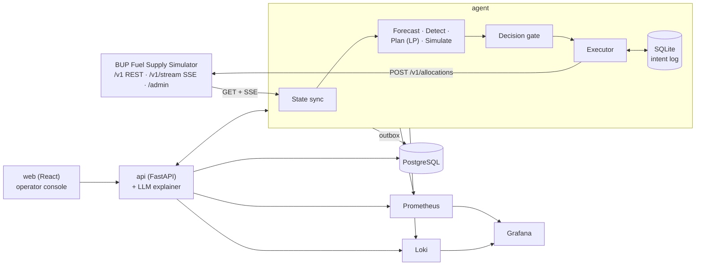

# BUP Fuel Supply Agent

**An intelligent decision-support and resilience platform for the BUP Fuel Supply Simulator.**
Built for the *BUP CSE Fest 2026 Hackathon Finals: Fuel Supply Intelligence & Resilience Platform* (in association with Poridhi.io).

> ⚠️ **All data in this project is simulated.** The platform operates only against the organizer-provided BUP Fuel Supply Simulator. It never touches real fuel infrastructure, real credentials, or real dispatches.

The platform watches a simulated Bangladeshi fuel network (2 regions, 2 depots, 4 stations, 6 routes, 3 fuels). It forecasts demand, detects emerging shortages, recommends and executes fuel allocations with a constrained optimiser, explains every decision, and keeps working when the simulator API, its own services or its dependencies fail.

```
Observe → Detect → Predict → Decide → Simulate → Act → Monitor → Recover
```

📐 **Full architecture and design rationale:** [`docs/SYSTEM_DESIGN.md`](docs/SYSTEM_DESIGN.md)

---

## Contents

- [Highlights](#highlights)
- [Architecture](#architecture)
- [Quick start](#quick-start)
- [Service URLs](#service-urls)
- [Configuration](#configuration)
- [Using the operator console](#using-the-operator-console)
- [Running the demo](#running-the-demo)
- [Intelligence](#intelligence)
- [Resilience](#resilience)
- [Observability](#observability)
- [Testing](#testing)
- [Load testing](#load-testing)
- [CI/CD and deployment](#cicd-and-deployment)
- [Project structure](#project-structure)
- [Data and assumptions](#data-and-assumptions)
- [Deliverables checklist](#deliverables-checklist)
- [Known limitations](#known-limitations)
- [Team](#team)
- [License](#license)

---

## Highlights

| Area | What we built |
|---|---|
| **Operator app** | React console showing network status, inventory, a stockout-risk heatmap, recommendations with approve/reject, a supply timeline, decision history, a what-if simulator, system health, and a chaos panel for demos |
| **Prediction** | Demand forecast per station × fuel × tick with P10/P50/P90 intervals: a structural prior plus online Bayesian correction, with censored-data handling |
| **Detection** | Stockout probability, demand anomalies (z-score and CUSUM), unexplained inventory changes, supply delays, depot runway, route-redundancy bottlenecks |
| **Decision** | Rolling-horizon **linear program** (OR-Tools) over both depots jointly, minimising unmet liters (exactly what `service_level` measures), with an order-up-to heuristic as fallback and benchmark |
| **Simulate** | Monte Carlo projection engine: *"Stockout risk 72% → 19% if we send 6,000 L from Gazipur"* |
| **Human in the loop** | Autopilot, Copilot and Manual autonomy levels, confidence scoring, and an approval queue with TTL and re-validation |
| **Generative AI** | LLM explanations of decisions, incident summaries, and a read-only ops assistant. **The LLM never makes decisions**, and every output has a template fallback |
| **Resilience** | Content-derived idempotency keys, a durable intent log, crash recovery, adaptive timeouts, NORMAL/DEGRADED/SAFE modes, SSE-optional operation |
| **Observability** | Prometheus metrics (application, domain, intelligence, system), Loki logs, provisioned Grafana dashboards and alert rules |
| **DevOps** | One-command `docker compose up`, GitHub Actions CI (lint, test, integration against the real simulator, smoke test), GHCR images, policy and deployment rollback |

---

## Architecture



| Service | Tech | Role |
|---|---|---|
| `simulator` | `asifmahmoud414/bup-fuel-supply-simulator:1.0.0` (unchanged) | The simulated world |
| `agent` | Python 3.12, asyncio, httpx, OR-Tools, NumPy, SQLite | Control loop: sync → forecast → detect → plan → simulate → gate → execute |
| `api` | FastAPI, SQLAlchemy, Pydantic v2 | Backend for the UI, approvals, what-if, explainer, chaos proxy |
| `web` | React, Vite, TypeScript, Recharts, nginx | Operator console |
| `postgres` | PostgreSQL 16 | History, decisions, alerts, policies |
| `prometheus`, `grafana`, `loki`, `promtail`, `cadvisor` | — | Observability |

The agent does **not** depend on Postgres, the API or the LLM to keep making decisions. The web console **never** calls the simulator directly. See [System Design §3](docs/SYSTEM_DESIGN.md#3-architecture-overview) for failure boundaries.

---

## Quick start

### Prerequisites

- Docker 24+ with Docker Compose v2
- About 4 GB of free RAM
- (Optional) An LLM API key for natural-language explanations. Without one, template explanations are used.
- (Optional, for development) Python 3.12, Node 20, `make`

### Run

```bash
git clone https://github.com/arafatislam123/OncodoseRx_BUP_fINAL.git
cd OncodoseRx_BUP_fINAL

cp .env.example .env          # edit OPERATOR_TOKEN, POSTGRES_PASSWORD, (optional) LLM_API_KEY
docker compose up -d --build

# wait until everything is healthy
docker compose ps
curl -s http://localhost:8000/v1/health     # simulator
curl -s http://localhost:8080/api/health    # our platform

# the simulator starts PAUSED by default. Start the clock:
make run            # = curl -X POST http://localhost:8000/admin/run
```

Open the operator console at **http://localhost:3000**.

Stop with `docker compose down`. Add `-v` to also wipe the volumes.

### First run: calibrate against the simulator (recommended)

```bash
make probes
```

This runs short stepped experiments in [`tools/probes/`](tools/probes) that settle simulator behaviours the integration guide does not specify (departure timing, dispatch-capacity accounting, tank overflow, and so on). Results are written to `config/world_facts.yaml`, which the planner reads. It takes about 1 minute and **resets the simulator** when done. See [System Design §21](docs/SYSTEM_DESIGN.md#21-day-one-probes).

---

## Service URLs

| Service | URL | Notes |
|---|---|---|
| Operator console | http://localhost:3000 | Main UI |
| Platform API | http://localhost:8080/docs | OpenAPI / Swagger |
| Simulator API | http://localhost:8000/docs | Organizer simulator |
| Simulator admin console | http://localhost:8000/admin | Organizer dashboard |
| Grafana | http://localhost:3001 | Credentials from `.env` |
| Prometheus | http://localhost:9090 | |

---

## Configuration

All configuration comes from environment variables (`.env`). No secrets are committed; only [`.env.example`](.env.example) is.

| Variable | Default | Description |
|---|---|---|
| `SIMULATOR_BASE_URL` | `http://simulator:8000` | Simulator address inside the compose network |
| `SIMULATION_SPEED` | `8` | Simulator ticks per wall-clock second (passed to the simulator container) |
| `TICK_MINUTES` | `15` | Simulated minutes per tick |
| `SIMULATOR_START_MODE` | `paused` | `paused` or `running` |
| `AGENT_AUTONOMY` | `copilot` | `autopilot` \| `copilot` \| `manual` |
| `PLANNER_POLICY` | `lp` | `lp` \| `heuristic` (forced fallback) |
| `PLANNER_HORIZON_TICKS` | `32` | LP planning horizon |
| `APPROVAL_TTL_TICKS` | `8` | Time before an unapproved recommendation is re-planned |
| `CONFIDENCE_REVIEW_THRESHOLD` | `0.6` | Below this, recommendations go to human review |
| `OPERATOR_TOKEN` | — (**required**) | Bearer token for approvals, mode changes and chaos endpoints |
| `POSTGRES_USER` / `POSTGRES_PASSWORD` / `POSTGRES_DB` | — (**required**) | Database credentials |
| `LLM_PROVIDER` / `LLM_MODEL` / `LLM_API_KEY` | empty | Optional. If empty, template explanations are used |
| `GRAFANA_ADMIN_USER` / `GRAFANA_ADMIN_PASSWORD` | — (**required**) | Grafana login |
| `IMAGE_TAG` | `latest` | Platform image tag (use a git sha to roll back) |
| `LOG_LEVEL` | `INFO` | |

Tuning parameters (safety-stock weights, mode thresholds, probe results) live in versioned files under [`config/`](config) and in the `policies` table. They can be switched at runtime with `PUT /api/policies/active`.

---

## Using the operator console

| Page | What you see / do |
|---|---|
| **Overview** | Depots, stations and routes coloured by status; inventory and days of cover per fuel; current mode; service level |
| **Risk & Alerts** | Stockout-probability heatmap, demand vs forecast (P10–P90), alert feed |
| **Recommendations** | Cards with projected stockout time, inventory, expected demand, recommended allocation, risk before → after, confidence, alternatives, binding constraints. **Approve / Reject** |
| **Supply & Disruptions** | Incoming supply timeline, events (scheduled, active, resolved), depot runway |
| **Decision History** | Every decision with its inputs, simulator outcome and explanation |
| **What-if** | Try a hypothetical crisis and see the projected impact without touching the simulator |
| **System Health** | Backend API, database, simulator, prediction service, decision engine, SSE, LLM; p95 latency; error rate |
| **Chaos** 🔒 | Inject simulator events and faults for demonstrations |

---

## Running the demo

The demo follows the brief's 14-step story (full mapping in [System Design §24](docs/SYSTEM_DESIGN.md#24-demo-story-mapping)). For a human-paced demo, set `SIMULATION_SPEED=2` in `.env`.

```bash
make reset && make run                       # 1–2   normal operations
make spike                                   # 3–8   Dhaka demand spike ×1.8 starting in 12 ticks
                                             #       → risk detected, shortage predicted, recommendation, approve, allocation
make crisis                                  # 9–10  Cox's Bazar route disruption + Gazipur supply shortfall ×0.5
make chaos-errors                            # 11    error_rate 0.4 for 45 s
make chaos-sse                               # 11    stream_disconnect for 30 s
docker kill fsa-agent                        # 11    crash the decision engine (it auto-restarts)
                                             # 12–14 watch Grafana: detection → DEGRADED → recovery → NORMAL
make chaos-clear                             # clear all faults
```

Each `make` target is a thin wrapper around the simulator's `/admin/events` and `/admin/faults` endpoints. Examples:

```bash
# demand spike (what `make spike` sends)
curl -X POST http://localhost:8000/admin/events -H 'Content-Type: application/json' \
  -d '{"type":"demand_spike","start_tick":<now+12>,"duration_ticks":24,
       "parameters":{"region_ids":["region-dhaka"],"multiplier":1.8}}'

# transient API errors (what `make chaos-errors` sends)
curl -X POST http://localhost:8000/admin/faults -H 'Content-Type: application/json' \
  -d '{"type":"error_rate","duration_seconds":45,"parameters":{"rate":0.4}}'
```

---

## Intelligence

| Capability | Method | Where |
|---|---|---|
| Demand forecast | Profile × hour-of-day × region prior, with an online log-normal Bayesian correction per (station, fuel, hour bucket); change-point reset; outage and stockout ticks excluded from learning | `agent/intelligence/forecaster.py` |
| Spike handling | One owner for demand multipliers, keyed by event id, with a consistency check against `station.demand_multiplier` (prevents double counting) | `agent/intelligence/multipliers.py` |
| Stockout probability | Monte Carlo (N = 200) over forecast residuals and at-risk supply | `agent/intelligence/projection.py` |
| Anomaly detection | Residual z-score + two-sided CUSUM; station inventory-balance check | `agent/intelligence/detector.py` |
| Allocation | Rolling-horizon LP (32 ticks): minimise unmet liters + safety-stock shortfall + stranded fuel + cross-region and shipment costs − depot flexibility value | `agent/intelligence/planner_lp.py` |
| Fallback / benchmark | Order-up-to heuristic, ranked by time to stockout | `agent/intelligence/planner_heuristic.py` |
| Explanations | LLM over structured decision records; deterministic templates as fallback | `api/explainer/` |

**Why an LP?** At this network size a linear program solves in milliseconds, plans both depots jointly, holds capacity for known future needs, and its objective *is* the judged metric (unmet liters). The heuristic runs in parallel as the fallback and as the baseline. Policy comparison results are in [`docs/results/policy_comparison.md`](docs/results/policy_comparison.md).

---

## Resilience

| Failure | Behaviour |
|---|---|
| Forecaster or planner fails | Structural prior and heuristic planner take over; `fallback_activations` metric |
| Invalid simulator response | Rejected by schema validation; last good state kept; alert raised |
| Low confidence | Sent to the human-review queue |
| Simulator 503s / error rate | Retries, then DEGRADED or SAFE mode (thresholds in **wall-clock seconds**, with hysteresis) |
| Latency fault | Adaptive timeouts; the planner targets the tick when the order will actually land |
| Stale data | Nowcast from the last fresh state; safety stock widens with blind time |
| SSE disconnected | REST polling continues; reconnect with backoff and full resync |
| Agent crash | Auto-restart; the durable intent log plus **content-derived idempotency keys** guarantee no duplicate allocations |
| Postgres / API / LLM down | The agent keeps operating (outbox); the UI shows the last known state and a banner; templates replace the LLM |
| Simulator reset | Detected; new key epoch; full resync |

Details: [System Design §9, §10 and §14](docs/SYSTEM_DESIGN.md#14-application-resilience-matrix).

---

## Observability

- **Metrics:** `agent:9100/metrics`, `api:8080/metrics`, and cAdvisor, all scraped by Prometheus.
- **Logs:** structured JSON with `cycle_id`, `tick`, `decision_id` and `idempotency_key`, shipped to Loki.
- **Dashboards** (provisioned from [`observability/grafana/`](observability/grafana)): *Ops Overview*, *Integration Health*, *Intelligence*, *Platform*.
- **Alert rules:** service level below 0.97, non-NORMAL mode for more than 30 s, agent blind (data too old), SSE down, fallback storm, unknown intents piling up.
- **Health endpoint:** `GET /api/health`:

```json
{
  "backend_api": "healthy", "database": "healthy", "fuel_simulator": "healthy",
  "prediction_service": "healthy", "decision_engine": "healthy", "sse": "connected",
  "llm": "fallback", "mode": "NORMAL", "data_age_ticks": 1,
  "p95_latency_ms": 164, "error_rate": 0.004
}
```

---

## Testing

```bash
make test               # unit + contract tests (pytest, vitest)
make test-integration   # starts the real simulator, runs stepped crisis scenarios S0–S5
make test-live          # runs at SIMULATION_SPEED=8 with a wall-clock fault schedule (S6)
make test-crash         # kills the agent mid-submit, asserts zero duplicate allocations
make compare-policies   # naive vs heuristic vs LP on S0–S5 → docs/results/policy_comparison.md
make replay DECISION=dec-000482   # re-run the planner on a recorded live snapshot
```

| Scenario | Description |
|---|---|
| S0 | Baseline, 1,200 ticks |
| S1 | Dhaka demand spike ×1.8 with warning |
| S2 | Same spike with **no** warning |
| S3 | Gazipur shipment delay + supply shortfall |
| S4 | Cox's Bazar single route disrupted |
| S5 | Combined crisis |
| S6 | S5 + API faults (latency, error rate, stale data), live mode |

---

## Load testing

k6 scripts are in [`loadtest/`](loadtest). We load-test **our** platform, not the single-tenant simulator.

```bash
make loadtest            # runs L1–L2, writes loadtest/results/summary.md
make loadtest-soak       # L3, 20 min
```

| Id | Path | Profile |
|---|---|---|
| L1 | `GET /api/state`, `/api/alerts`, `/api/recommendations` | 10 → 200 VUs |
| L2 | `POST /api/whatif` (LP + Monte Carlo) | 5 → 50 VUs |
| L3 | L1 soak | 50 VUs × 20 min |
| L4 | L1 at peak while the agent runs live | Agent cycle latency must be unaffected |

Reported: average, p50, p95 and p99 latency, throughput, error rate, concurrency, CPU and memory, and the concurrency at which the SLO breaks.

**Results:** [`loadtest/results/summary.md`](loadtest/results/summary.md) *(fill in after running)*

| Scenario | VUs | RPS | p50 | p95 | p99 | Errors | CPU (api) | Mem (api) |
|---|---|---|---|---|---|---|---|---|
| L1 | 200 | — | — | — | — | — | — | — |
| L2 | 50 | — | — | — | — | — | — | — |

---

## CI/CD and deployment

```
Source → Lint/Type → Unit tests → Build → Integration tests (real simulator) → Compose smoke test → Push to GHCR → Release
```

- `.github/workflows/ci.yml` runs on every PR: ruff, mypy, eslint, tsc, pytest, vitest, image build, stepped integration tests against the simulator service container, and a compose smoke test (up → health → 100 steps → assert metrics).
- `.github/workflows/release.yml` runs on tags and pushes images to GHCR tagged with the git sha and semver.
- `.github/workflows/loadtest.yml` is manual and uploads the k6 summary as an artifact.

**Rollback:**

```bash
IMAGE_TAG=<previous-sha> docker compose up -d                  # deployment rollback
curl -X PUT localhost:8080/api/policies/active \
  -H "Authorization: Bearer $OPERATOR_TOKEN" -d '{"version":"lp-v2"}'   # policy rollback
```

---

## Project structure

```
OncodoseRx_BUP_fINAL/
├── agent/                      # decision engine (Python)
│   ├── sync/                   # REST poller, SSE listener, cache, validation
│   ├── intelligence/           # forecaster, multipliers, detector, planner_lp, planner_heuristic, projection
│   ├── execution/              # gate, executor, intent log, idempotency keys
│   ├── control/                # mode controller, timing model
│   └── main.py
├── api/                        # FastAPI backend, explainer, chaos proxy
├── web/                        # React operator console
├── config/
│   ├── world_prior.yaml        # demand profiles and hour factors from the integration guide (priors)
│   ├── world_facts.yaml        # written by `make probes`
│   └── policy.default.yaml
├── tools/
│   ├── probes/                 # day-one calibration experiments (P1–P9)
│   └── replay.py
├── harness/                    # stepped + live scenario runners, crash test, policy comparison
├── loadtest/                   # k6 scripts and results
├── observability/              # prometheus.yml, alert rules, grafana dashboards, loki/promtail config
├── tests/                      # unit, contract, integration
├── docs/
│   ├── SYSTEM_DESIGN.md
│   └── results/
├── .github/workflows/
├── docker-compose.yml
├── Makefile
├── .env.example
└── README.md
```

---

## Data and assumptions

- **Primary data source:** the organizer's BUP Fuel Supply Simulator (baseline scenario, seed 12345). No external or real-world datasets are used.
- **Derived data:** our own Postgres mirror of demand history, forecasts, decisions and snapshots, generated entirely from simulator runs.
- **Priors:** demand profiles, hour-of-day factors and topology copied from the integration guide into `config/world_prior.yaml`. They are used as priors that the forecaster corrects online, not as fixed truth.
- **Undocumented simulator behaviour** (departure timing, dispatch-capacity accounting, overflow, outage arrivals, censoring, stale age) is measured by `make probes` rather than assumed. Until then, the planner uses conservative defaults. See [System Design §21](docs/SYSTEM_DESIGN.md#21-day-one-probes).
- **Human review** is preserved for consequential simulated decisions (Copilot mode by default).

---

## Deliverables checklist

Mapped to brief §19:

| # | Deliverable | Where |
|---|---|---|
| 1 | Working application | `docker compose up`, then http://localhost:3000 |
| 2 | Source repository | This repo: code, setup, dependencies, deployment |
| 3 | Simulator integration | `agent/sync`, `agent/execution` (REST, SSE, allocations) |
| 4 | Intelligence component | `agent/intelligence` (forecast, detection, LP optimisation, Monte Carlo) |
| 5 | Operator interface | `web/` |
| 6 | Architecture diagram | [System Design §3](docs/SYSTEM_DESIGN.md#3-architecture-overview) |
| 7 | Deployment | `docker-compose.yml`, GHCR images, CI |
| 8 | Observability evidence | Grafana dashboards, alert rules, Loki logs, `/api/health` |
| 9 | Resilience demonstration | Demo steps 11–14; `make test-crash`; `make test-live` |
| 10 | Load-test evidence | `loadtest/results/summary.md` |
| 11 | Final demo | [System Design §24](docs/SYSTEM_DESIGN.md#24-demo-story-mapping) |

---

## Known limitations

- The LP plans on mean demand. Uncertainty enters through safety stock and Monte Carlo evaluation, not full stochastic optimisation.
- A combined crisis with no warning can still cause unavoidable unmet demand at single-route stations (Tongi, Cox's Bazar). The system minimises and explains it.
- Live runs are not bit-for-bit reproducible (network timing and wall-clock faults). Stepped runs are, and any live decision can be replayed offline.
- Human approval is impractical at speed 8 (125 ms per tick). Use Copilot at speed 1–2, or Autopilot at full speed.

The full list is in [System Design §23](docs/SYSTEM_DESIGN.md#23-known-remaining-limitations).

---

## Team

| Name | Role | GitHub |
|---|---|---|
| Arafat Islam | _TBD_ | [@arafatislam123](https://github.com/arafatislam123) |
| _TBD_ | _TBD_ | |

## License

MIT (or as required by the hackathon organizers).
