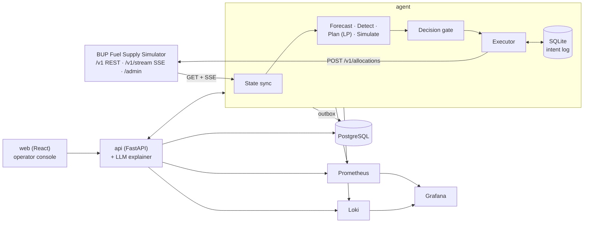

# BUP Fuel Supply Agent

Our team's project for the BUP CSE Fest 2026 Hackathon Finals (Fuel Supply Intelligence & Resilience Platform, in association with Poridhi.io).

It's a decision-support platform that sits on top of the BUP Fuel Supply Simulator. It watches a small simulated fuel network in Bangladesh (2 regions, 2 depots, 4 stations, 6 routes and 3 fuel types), predicts demand, spots shortages before they happen, decides where to send fuel, and explains why. We also put a lot of effort into making it keep working when things break: the simulator API, our own services or the database.

Note: everything here runs against the organizer's simulator only. No real fuel infrastructure, credentials or dispatches are involved, and all the data is simulated.

The basic loop the agent runs is:

```
Observe -> Detect -> Predict -> Decide -> Simulate -> Act -> Monitor -> Recover
```

The full design write-up is in [docs/SYSTEM_DESIGN.md](docs/SYSTEM_DESIGN.md).

## Table of contents

- [What it does](#what-it-does)
- [Architecture](#architecture)
- [Getting started](#getting-started)
- [URLs](#urls)
- [Configuration](#configuration)
- [The operator console](#the-operator-console)
- [Running the demo](#running-the-demo)
- [How the intelligence works](#how-the-intelligence-works)
- [Handling failures](#handling-failures)
- [Monitoring](#monitoring)
- [Tests](#tests)
- [Load testing](#load-testing)
- [CI/CD and deployment](#cicd-and-deployment)
- [Project structure](#project-structure)
- [Data and assumptions](#data-and-assumptions)
- [Deliverables](#deliverables)
- [Known limitations](#known-limitations)
- [Team](#team)

## What it does

- **Operator console (React).** Shows the network status, inventory levels, a stockout-risk heatmap, recommendations you can approve or reject, a supply timeline, decision history, a what-if simulator, system health, and a chaos panel we use during the demo.
- **Demand forecasting.** Forecasts demand for every station, fuel and tick, with P10/P50/P90 ranges. It starts from a prior based on the integration guide and corrects itself online as real (simulated) sales come in.
- **Shortage detection.** Stockout probability, demand anomalies (z-score and CUSUM), inventory changes that don't add up, delayed supply, how long each depot can last, and stations that depend on a single route.
- **Allocation.** A linear program (OR-Tools) plans both depots together over a rolling window and tries to minimise unmet liters, which is the same thing `service_level` measures. A simpler order-up-to heuristic runs next to it as a fallback and a baseline to compare against.
- **What-if projections.** A Monte Carlo engine that gives answers like "stockout risk drops from 72% to 19% if we send 6,000 L from Gazipur".
- **Human in the loop.** Three autonomy levels (Autopilot, Copilot, Manual), a confidence score on each recommendation, and an approval queue where old recommendations expire and get re-checked.
- **LLM explanations.** An LLM writes plain-language explanations and incident summaries, and there's a read-only assistant for questions. The LLM never makes a decision, and if it isn't available we fall back to templates.
- **Resilience.** Idempotency keys, a durable intent log, crash recovery, adaptive timeouts, and NORMAL / DEGRADED / SAFE modes. The live SSE stream is optional.
- **Monitoring.** Prometheus metrics, Loki logs, and Grafana dashboards and alerts that are set up automatically.
- **DevOps.** Everything starts with one `docker compose up`. GitHub Actions runs lint, tests, integration tests against the real simulator and a smoke test, then publishes images to GHCR. Both deployments and planner policies can be rolled back.

## Architecture



| Service | Built with | What it does |
|---|---|---|
| `simulator` | `asifmahmoud414/bup-fuel-supply-simulator:1.0.0` (unmodified) | The simulated world |
| `agent` | Python 3.12, asyncio, httpx, OR-Tools, NumPy, SQLite | The main loop: sync, forecast, detect, plan, simulate, gate, execute |
| `api` | FastAPI, SQLAlchemy, Pydantic v2 | Backend for the UI: approvals, what-if, explanations, chaos proxy |
| `web` | React, Vite, TypeScript, Recharts, nginx | Operator console |
| `postgres` | PostgreSQL 16 | Stores history, decisions, alerts and policies |
| `prometheus`, `grafana`, `loki`, `promtail`, `cadvisor` | | Monitoring |

Two design rules we stuck to: the agent keeps making decisions even if Postgres, the API or the LLM goes down, and the web console never talks to the simulator directly. Section 3 of the [design doc](docs/SYSTEM_DESIGN.md#3-architecture-overview) explains the failure boundaries in more detail.

## Getting started

You'll need:

- Docker 24 or newer, with Docker Compose v2
- Around 4 GB of free RAM
- An LLM API key if you want generated explanations (optional; without one you get template text)
- Python 3.12, Node 20 and `make` if you want to work on the code (optional)

Then:

```bash
git clone https://github.com/arafatislam123/OncodoseRx_BUP_fINAL.git
cd OncodoseRx_BUP_fINAL

cp .env.example .env    # set OPERATOR_TOKEN and POSTGRES_PASSWORD, and LLM_API_KEY if you have one
docker compose up -d --build

# check that everything came up
docker compose ps
curl -s http://localhost:8000/v1/health     # simulator
curl -s http://localhost:8080/api/health    # our platform

# the simulator starts paused, so start the clock
make run    # same as: curl -X POST http://localhost:8000/admin/run
```

Now open http://localhost:3000.

To stop everything, run `docker compose down` (add `-v` to delete the volumes too).

### Calibrating against the simulator

We recommend running this once before anything else:

```bash
make probes
```

The integration guide doesn't cover some simulator behaviour, like exactly when a shipment departs, how dispatch capacity is counted, or what happens when a tank overflows. The scripts in [tools/probes/](tools/probes) run short experiments to measure these and save the results to `config/world_facts.yaml`, which the planner uses. It takes about a minute and resets the simulator at the end. More in section 21 of the [design doc](docs/SYSTEM_DESIGN.md#21-day-one-probes).

## URLs

| Service | URL | Notes |
|---|---|---|
| Operator console | http://localhost:3000 | Main UI |
| Platform API | http://localhost:8080/docs | Swagger docs |
| Simulator API | http://localhost:8000/docs | Organizer's simulator |
| Simulator admin | http://localhost:8000/admin | Organizer's dashboard |
| Grafana | http://localhost:3001 | Login details are in `.env` |
| Prometheus | http://localhost:9090 | |

## Configuration

Everything is configured through environment variables in `.env`. We only commit [.env.example](.env.example), never real secrets.

| Variable | Default | What it's for |
|---|---|---|
| `SIMULATOR_BASE_URL` | `http://simulator:8000` | Where the agent finds the simulator inside the compose network |
| `SIMULATION_SPEED` | `8` | Simulator ticks per real second |
| `TICK_MINUTES` | `15` | Simulated minutes per tick |
| `SIMULATOR_START_MODE` | `paused` | `paused` or `running` |
| `AGENT_AUTONOMY` | `copilot` | `autopilot`, `copilot` or `manual` |
| `PLANNER_POLICY` | `lp` | `lp`, or `heuristic` to force the fallback |
| `PLANNER_HORIZON_TICKS` | `32` | How far ahead the LP plans |
| `APPROVAL_TTL_TICKS` | `8` | How long a recommendation waits for approval before it's re-planned |
| `CONFIDENCE_REVIEW_THRESHOLD` | `0.6` | Recommendations below this confidence always go to a human |
| `OPERATOR_TOKEN` | required | Bearer token for approvals, mode changes and chaos endpoints |
| `POSTGRES_USER`, `POSTGRES_PASSWORD`, `POSTGRES_DB` | required | Database credentials |
| `LLM_PROVIDER`, `LLM_MODEL`, `LLM_API_KEY` | empty | Optional; leave empty to use templates |
| `GRAFANA_ADMIN_USER`, `GRAFANA_ADMIN_PASSWORD` | required | Grafana login |
| `IMAGE_TAG` | `latest` | Which image version to run (set a git sha to roll back) |
| `LOG_LEVEL` | `INFO` | |

Tuning values like safety-stock weights, mode thresholds and probe results live in versioned files under [config/](config) and in the `policies` table. You can switch the active policy while the system is running with `PUT /api/policies/active`.

## The operator console

- **Overview:** depots, stations and routes coloured by status, inventory and days of cover per fuel, the current mode and the service level.
- **Risk & Alerts:** the stockout heatmap, demand against forecast (P10 to P90), and the alert feed.
- **Recommendations:** one card per recommendation with the projected stockout time, current inventory, expected demand, the suggested allocation, risk before and after, confidence, alternatives and the constraints that limited the plan. This is where you approve or reject.
- **Supply & Disruptions:** incoming supply, scheduled/active/resolved events, and how long each depot can last.
- **Decision History:** every decision with its inputs, what the simulator did with it, and the explanation.
- **What-if:** try out a made-up crisis and see what would happen, without touching the simulator.
- **System Health:** status of the API, database, simulator, forecaster, decision engine, SSE and LLM, plus p95 latency and error rate.
- **Chaos (needs the operator token):** inject simulator events and faults during a demo.

## Running the demo

The demo follows the 14-step story from the brief (section 24 of the [design doc](docs/SYSTEM_DESIGN.md#24-demo-story-mapping) maps each step). If you're presenting to people, set `SIMULATION_SPEED=2` in `.env` so it's easier to follow.

```bash
make reset && make run    # steps 1-2: normal operations
make spike                # steps 3-8: Dhaka demand goes up 1.8x in 12 ticks
                          #   the risk gets detected, a shortage is predicted,
                          #   a recommendation shows up, you approve it, fuel is sent
make crisis               # steps 9-10: Cox's Bazar route cut + Gazipur supply halved
make chaos-errors         # step 11: 40% of API calls fail for 45 s
make chaos-sse            # step 11: SSE stream drops for 30 s
docker kill fsa-agent     # step 11: crash the decision engine (it restarts by itself)
                          # steps 12-14: watch Grafana go from detection to DEGRADED and back to NORMAL
make chaos-clear          # clear all faults
```

The `make` targets just call the simulator's `/admin/events` and `/admin/faults` endpoints. For example:

```bash
# what `make spike` sends
curl -X POST http://localhost:8000/admin/events -H 'Content-Type: application/json' \
  -d '{"type":"demand_spike","start_tick":<now+12>,"duration_ticks":24,
       "parameters":{"region_ids":["region-dhaka"],"multiplier":1.8}}'

# what `make chaos-errors` sends
curl -X POST http://localhost:8000/admin/faults -H 'Content-Type: application/json' \
  -d '{"type":"error_rate","duration_seconds":45,"parameters":{"rate":0.4}}'
```

## How the intelligence works

| Part | Approach | Code |
|---|---|---|
| Demand forecast | Starts from profile x hour-of-day x region, then applies an online log-normal Bayesian correction for each station, fuel and hour bucket. It resets on sudden changes and ignores ticks where a station was out of stock or offline, since those don't show real demand. | `agent/intelligence/forecaster.py` |
| Demand spikes | A single component tracks all demand multipliers by event id and checks them against `station.demand_multiplier`, so a spike never gets counted twice. | `agent/intelligence/multipliers.py` |
| Stockout probability | Monte Carlo with 200 runs, sampling forecast errors and supply that might not arrive. | `agent/intelligence/projection.py` |
| Anomalies | z-score on forecast errors, two-sided CUSUM, and a check that each station's inventory balances. | `agent/intelligence/detector.py` |
| Allocation | LP over a 32-tick window. It minimises unmet liters, safety-stock shortfall, stranded fuel and shipping costs, while valuing keeping some flexibility at the depots. | `agent/intelligence/planner_lp.py` |
| Fallback | Order-up-to heuristic that serves the stations closest to running out first. | `agent/intelligence/planner_heuristic.py` |
| Explanations | LLM over the structured decision record, with fixed templates as a backup. | `api/explainer/` |

Why we went with an LP: the network is small enough that it solves in milliseconds, it can plan both depots at once, it can hold back capacity for needs it already knows about, and what it minimises is exactly what we're judged on (unmet liters). The heuristic runs alongside it, both as a fallback and so we have something to compare against. The comparison is in [docs/results/policy_comparison.md](docs/results/policy_comparison.md).

## Handling failures

| What goes wrong | What the system does |
|---|---|
| Forecaster or planner crashes | Falls back to the prior forecast and the heuristic planner, and counts it in the `fallback_activations` metric |
| Simulator sends bad data | Schema validation rejects it, the last good state is kept, and an alert is raised |
| Low confidence in a recommendation | It goes to the human review queue |
| Simulator returning errors or 503s | Retries first, then switches to DEGRADED or SAFE mode. Thresholds are in real seconds, with hysteresis so it doesn't flip back and forth |
| Simulator is slow | Timeouts adapt, and the planner plans for the tick when the order will actually arrive |
| Data is stale | Estimates the current state from the last good data, and adds more safety stock the longer it's been blind |
| SSE disconnects | REST polling carries on; it reconnects with backoff and does a full resync |
| Agent crashes | It restarts automatically. The intent log and idempotency keys (built from the content of the order) make sure no allocation is ever sent twice |
| Postgres, API or LLM goes down | The agent keeps working and queues its writes. The UI shows the last known state with a banner, and templates replace the LLM |
| Simulator gets reset | We detect it, start a new key epoch and resync everything |

Sections 9, 10 and 14 of the [design doc](docs/SYSTEM_DESIGN.md#14-application-resilience-matrix) go into more detail.

## Monitoring

- Metrics come from `agent:9100/metrics`, `api:8080/metrics` and cAdvisor, and Prometheus scrapes all of them.
- Logs are JSON with `cycle_id`, `tick`, `decision_id` and `idempotency_key` fields, and go to Loki.
- Grafana has four dashboards set up from [observability/grafana/](observability/grafana): Ops Overview, Integration Health, Intelligence and Platform.
- Alerts fire when the service level drops below 0.97, the mode isn't NORMAL for more than 30 seconds, the agent's data is too old, SSE is down, fallbacks are firing a lot, or unconfirmed intents are building up.
- `GET /api/health` returns something like this:

```json
{
  "backend_api": "healthy", "database": "healthy", "fuel_simulator": "healthy",
  "prediction_service": "healthy", "decision_engine": "healthy", "sse": "connected",
  "llm": "fallback", "mode": "NORMAL", "data_age_ticks": 1,
  "p95_latency_ms": 164, "error_rate": 0.004
}
```

## Tests

```bash
make test               # unit and contract tests (pytest, vitest)
make test-integration   # runs scenarios S0-S5 step by step against the real simulator
make test-live          # S6 at SIMULATION_SPEED=8 with faults on a real-time schedule
make test-crash         # kills the agent mid-submit and checks nothing was sent twice
make compare-policies   # naive vs heuristic vs LP on S0-S5, writes docs/results/policy_comparison.md
make replay DECISION=dec-000482   # re-runs the planner on a saved snapshot
```

| Scenario | What happens |
|---|---|
| S0 | Normal operations for 1,200 ticks |
| S1 | Dhaka demand spike of 1.8x, announced in advance |
| S2 | The same spike with no warning |
| S3 | Gazipur shipment delayed and supply cut |
| S4 | Cox's Bazar's only route is disrupted |
| S5 | All of the above at once |
| S6 | S5 plus API faults (latency, errors, stale data), running live |

## Load testing

The k6 scripts are in [loadtest/](loadtest). We load-test our own platform, not the simulator, since the simulator only serves one client.

```bash
make loadtest         # runs L1 and L2, writes loadtest/results/summary.md
make loadtest-soak    # L3, takes 20 minutes
```

| Test | Endpoint | Load |
|---|---|---|
| L1 | `GET /api/state`, `/api/alerts`, `/api/recommendations` | 10 up to 200 virtual users |
| L2 | `POST /api/whatif` (LP + Monte Carlo) | 5 up to 50 virtual users |
| L3 | Same as L1, sustained | 50 virtual users for 20 minutes |
| L4 | L1 at peak while the agent is running live | The agent's cycle time shouldn't change |

For each test we record average, p50, p95 and p99 latency, throughput, error rate, CPU and memory, and the point where we stop meeting the SLO.

Results go in [loadtest/results/summary.md](loadtest/results/summary.md). We haven't filled this in yet:

| Test | Users | RPS | p50 | p95 | p99 | Errors | API CPU | API memory |
|---|---|---|---|---|---|---|---|---|
| L1 | 200 | | | | | | | |
| L2 | 50 | | | | | | | |

## CI/CD and deployment

```
Source -> Lint/type check -> Unit tests -> Build -> Integration tests (real simulator) -> Compose smoke test -> Push to GHCR -> Release
```

- `.github/workflows/ci.yml` runs on every pull request: ruff, mypy, eslint, tsc, pytest, vitest, image builds, integration tests against the simulator, and a smoke test that starts the whole stack, checks health, runs 100 steps and checks the metrics.
- `.github/workflows/release.yml` runs when we push a tag and publishes images to GHCR, tagged with the git sha and version.
- `.github/workflows/loadtest.yml` is run by hand and uploads the k6 summary.

To roll back:

```bash
# go back to an older deployment
IMAGE_TAG=<previous-sha> docker compose up -d

# go back to an older planner policy
curl -X PUT localhost:8080/api/policies/active \
  -H "Authorization: Bearer $OPERATOR_TOKEN" -d '{"version":"lp-v2"}'
```

## Project structure

```
OncodoseRx_BUP_fINAL/
├── agent/                  # decision engine (Python)
│   ├── sync/               # REST polling, SSE listener, cache, validation
│   ├── intelligence/       # forecaster, multipliers, detector, LP and heuristic planners, projection
│   ├── execution/          # decision gate, executor, intent log, idempotency keys
│   ├── control/            # mode controller, timing model
│   └── main.py
├── api/                    # FastAPI backend, explainer, chaos proxy
├── web/                    # React operator console
├── config/
│   ├── world_prior.yaml    # demand profiles and hour factors from the integration guide
│   ├── world_facts.yaml    # created by `make probes`
│   └── policy.default.yaml
├── tools/
│   ├── probes/             # calibration experiments (P1-P9)
│   └── replay.py
├── harness/                # scenario runners, crash test, policy comparison
├── loadtest/               # k6 scripts and results
├── observability/          # Prometheus, alert rules, Grafana dashboards, Loki/Promtail
├── tests/                  # unit, contract and integration tests
├── docs/
│   ├── SYSTEM_DESIGN.md
│   └── results/
├── .github/workflows/
├── docker-compose.yml
├── Makefile
├── .env.example
└── README.md
```

## Data and assumptions

- All our data comes from the organizer's simulator (baseline scenario, seed 12345). We don't use any outside or real-world data.
- We keep our own copy of demand history, forecasts, decisions and snapshots in Postgres, all generated from simulator runs.
- The demand profiles, hour-of-day factors and network layout come from the integration guide and are stored in `config/world_prior.yaml`. The forecaster treats them as a starting point and corrects them as it goes.
- Anything the guide doesn't say about the simulator (departure timing, dispatch capacity, overflow, arrivals during outages, censored demand, how stale data is) gets measured with `make probes` instead of guessed. Until the probes are run, the planner uses cautious defaults.
- By default the agent runs in Copilot mode, so a person still approves the important decisions.

## Deliverables

Mapped to section 19 of the brief:

| # | Deliverable | Where to find it |
|---|---|---|
| 1 | Working application | `docker compose up`, then http://localhost:3000 |
| 2 | Source code | This repo (code, setup, dependencies, deployment) |
| 3 | Simulator integration | `agent/sync` and `agent/execution` (REST, SSE, allocations) |
| 4 | Intelligence | `agent/intelligence` (forecasting, detection, LP, Monte Carlo) |
| 5 | Operator interface | `web/` |
| 6 | Architecture diagram | Section 3 of the [design doc](docs/SYSTEM_DESIGN.md#3-architecture-overview) |
| 7 | Deployment | `docker-compose.yml`, GHCR images, CI |
| 8 | Monitoring evidence | Grafana dashboards, alert rules, Loki logs, `/api/health` |
| 9 | Resilience demo | Demo steps 11-14, `make test-crash`, `make test-live` |
| 10 | Load test results | `loadtest/results/summary.md` |
| 11 | Final demo | Section 24 of the [design doc](docs/SYSTEM_DESIGN.md#24-demo-story-mapping) |

## Known limitations

- The LP plans using average demand. Uncertainty is handled through safety stock and the Monte Carlo checks, not by a fully stochastic model.
- If a big crisis hits with no warning, stations with only one route (Tongi and Cox's Bazar) can still run short no matter what we do. The system keeps the shortfall as small as it can and explains what happened.
- Live runs can't be reproduced exactly because of network timing and real-time faults. Step-by-step runs can, and any live decision can be replayed offline.
- At speed 8 a tick lasts 125 ms, which is too fast for a person to approve anything. Use Copilot at speed 1 or 2, or Autopilot at full speed.

Section 23 of the [design doc](docs/SYSTEM_DESIGN.md#23-known-remaining-limitations) has the full list.

## Team

| Name | Role | GitHub |
|---|---|---|
| Arafat Islam | | [@arafatislam123](https://github.com/arafatislam123) |
| | | |

## License

MIT, unless the hackathon organizers require something else.
