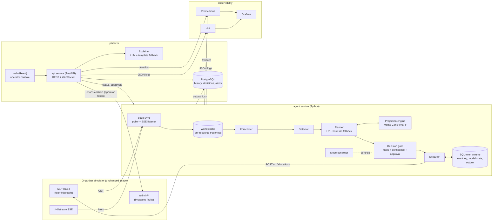
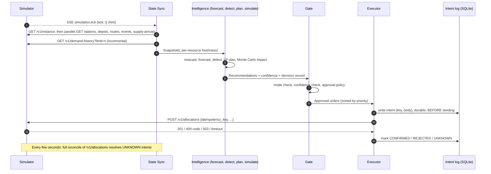
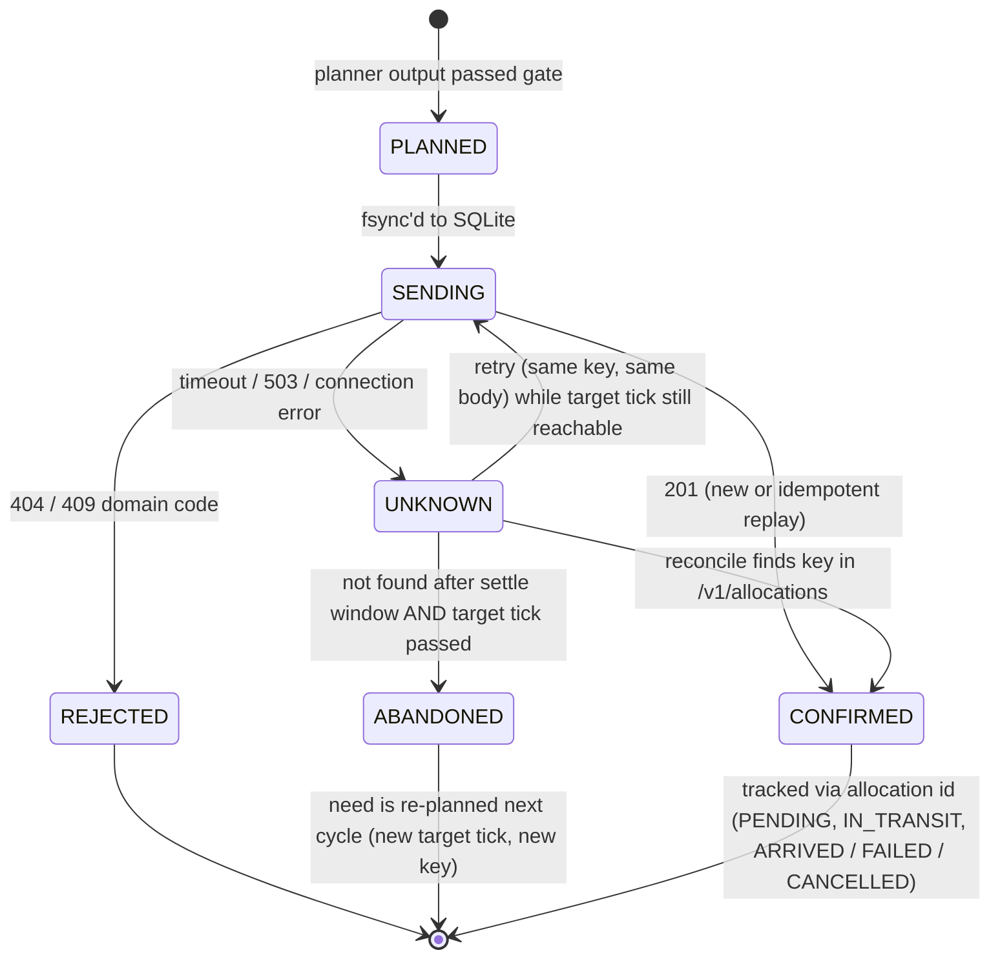
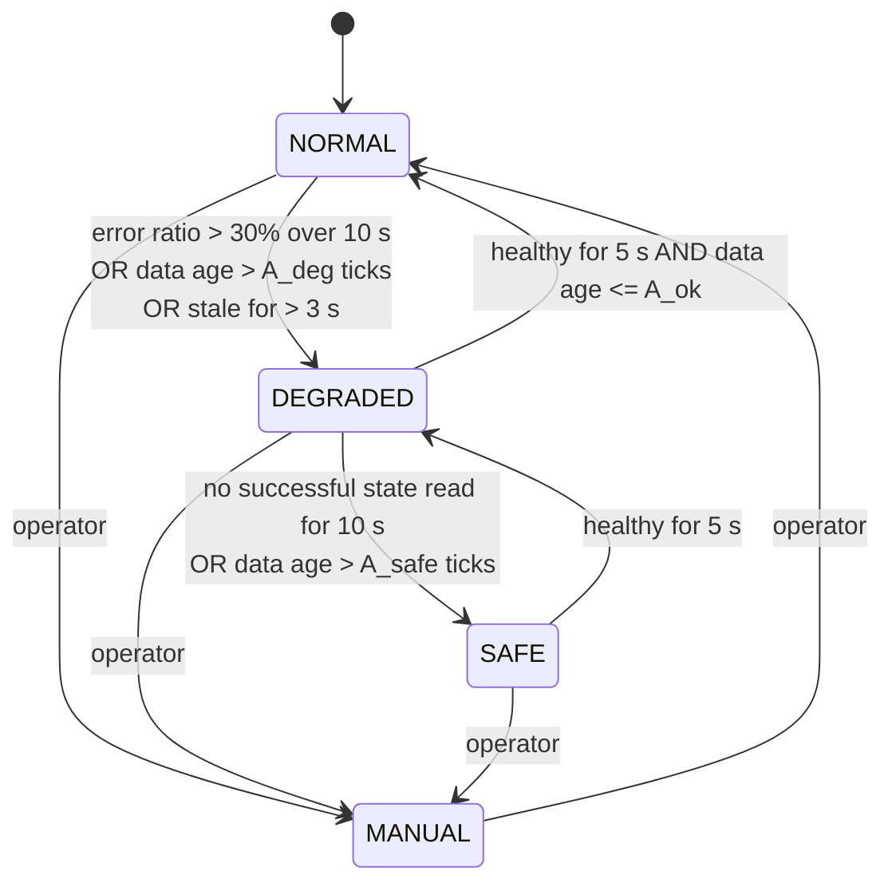
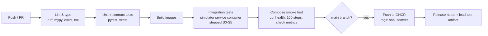

# BUP Fuel Supply Agent: System Design

- **Version:** 2.0. We rewrote v1 after an internal review found a list of problems with it (see [section 22](#22-what-changed-from-v1)).
- **Event:** BUP CSE Fest 2026 Hackathon Finals, Fuel Supply Intelligence & Resilience Platform
- **Simulator:** `asifmahmoud414/bup-fuel-supply-simulator:1.0.0`

Everything in this document runs against the organizer's simulated fuel network. No real fuel infrastructure, credentials, purchases or dispatches are involved.

## Contents

1. [Goals and non-goals](#1-goals-and-non-goals)
2. [Sizing up the network](#2-sizing-up-the-network)
3. [Architecture](#3-architecture)
4. [Components](#4-components)
5. [The control loop](#5-the-control-loop)
6. [Ticks vs real time](#6-ticks-vs-real-time)
7. [Keeping state in sync](#7-keeping-state-in-sync)
8. [The intelligence layer](#8-the-intelligence-layer)
9. [Sending orders safely](#9-sending-orders-safely)
10. [Operating modes](#10-operating-modes)
11. [Human review](#11-human-review)
12. [Where the LLM fits in](#12-where-the-llm-fits-in)
13. [Handling each kind of crisis](#13-handling-each-kind-of-crisis)
14. [Handling failures in our own system](#14-handling-failures-in-our-own-system)
15. [Data model](#15-data-model)
16. [Backend API](#16-backend-api)
17. [Monitoring](#17-monitoring)
18. [Testing and load testing](#18-testing-and-load-testing)
19. [Deployment and CI/CD](#19-deployment-and-cicd)
20. [Security](#20-security)
21. [Day-one probes](#21-day-one-probes)
22. [What changed from v1](#22-what-changed-from-v1)
23. [Known limitations](#23-known-limitations)
24. [Demo walkthrough](#24-demo-walkthrough)

## 1. Goals and non-goals

### What we're aiming for

| # | Goal | How we measure it |
|---|---|---|
| G1 | Keep stations stocked, i.e. get `service_level` from `GET /v1/metrics` as high as possible | Service level per scenario, unmet liters |
| G2 | Stay correct when the API misbehaves (latency, 503s, stale data, SSE dropping) | No duplicate allocations, few rejections, every mode change logged |
| G3 | Give operators a clear picture of the state, the risks, what we recommend and why | Dashboard and decision records |
| G4 | Keep a person in charge of big or uncertain decisions | Approval queue and audit history |
| G5 | Make it easy to run, watch and load-test | `docker compose up`, Grafana dashboards, k6 reports, CI |

### What we're not doing

- Building our own simulator or fake dataset. The organizer's simulator is the world.
- Changing the simulator image or its code.
- Enterprise security, multi-tenant hosting or Kubernetes. Kubernetes is optional and only if we have time (see 19.4).
- Letting an LLM make or change allocation decisions.

### Rules we followed

1. **REST is the truth, SSE is just a nudge.** When an SSE event arrives we go and read the REST API. We never act on SSE data alone.
2. **Real seconds for API health, ticks for how old the data is.** These are separate things and we keep them apart. Mixing them was the biggest mistake in v1.
3. **An order is identified by what's in it.** Idempotency keys come from what's being shipped, not from when our process happened to run.
4. **Measure instead of guessing.** Where the guide doesn't say how the simulator behaves, we find out with probes (section 21) and write the answer to a config file.
5. **One owner per concern.** Demand multipliers, data freshness and the operating mode are each handled by exactly one module.
6. **Degrade, don't die.** Every dependency has a fallback, and the dashboard shows when a fallback is in use.

## 2. Sizing up the network

These numbers come from section 8 of the integration guide (baseline scenario, 15-minute ticks, 96 ticks per simulated day). D / P / O means diesel / petrol / octane.

| Station | Profile | Region factor | Avg demand per tick (D / P / O) | Peak per tick (D / P / O) | Starting cover in ticks (D / P / O) | Tank size in days of demand |
|---|---|---|---|---|---|---|
| Mirpur | urban_high | 1.00 | 89 / 109 / 58 | 128 / 159 / 85 | 102 / 82 / 86 | 1.3-1.8 |
| Tongi | industrial | 1.00 | 146 / 47 / 23 | 226 / 73 / 36 | 75 / 128 / 153 | 1.3-2.7 |
| Karnaphuli | highway | 1.08 | 118 / 124 / 70 | 160 / 167 / 94 | 72 / 77 / 75 | 1.2-1.3 |
| Cox's Bazar | regional | 1.08 | 81 / 86 / 41 | 101 / 107 / 51 | 93 / 88 / 104 | 1.5-1.8 |

What we took from this:

- **Dispatch capacity isn't the problem.** Peak demand in a region is around 700 L per tick, and each depot can dispatch 11,000-12,000 L per tick. The cap only matters when we need to refill a lot at once after a disruption.
- **Tank space is the real limit.** Tanks only hold 1.2 to 2.7 days of demand, and the simulator checks `DESTINATION_CAPACITY_EXCEEDED` against the current inventory when the order is created. So we have to send lots of right-sized shipments rather than a few big ones.
- **Stockouts come from supply problems.** In the baseline, each resupply brings about one day of regional demand every 16 simulated hours. What actually causes stockouts is `supply_shortfall`, `shipment_delay`, `route_disruption` and `demand_spike`, especially when several happen together.
- **Two stations only have one route.** Tongi can only be supplied from Gazipur and Cox's Bazar only from Patiya, so a cross-region route can't save them. We work out route redundancy from `/v1/routes` instead of hard-coding station names.
- **Time moves fast.** At the default `SIMULATION_SPEED=8`, a tick is 125 ms and a simulated day is 12 seconds. The whole supply schedule (22 arrivals, about 1,170 ticks) is over in roughly 2.5 minutes.

## 3. Architecture



We split things into separate services so that one failing doesn't take the others down:

| If this goes down | This still works |
|---|---|
| `api`, `web` or Postgres | The agent keeps making decisions. Its decision records wait in a SQLite outbox and get written to Postgres when it's back. |
| `agent` | Operators can still see the last known state and history, with a red "Decision Engine: DOWN" status. |
| The LLM provider | Explanations switch to templates. Decisions aren't affected at all. |
| Simulator `/v1/*` (faults) | The agent moves to DEGRADED or SAFE mode (section 10), and the dashboard shows how old the data is and which mode we're in. |
| Prometheus, Grafana or Loki | Nothing that matters for operations. The agent's `/status` endpoint and the health page still work. |

The web console never calls the simulator directly, so people using the dashboard can't slow down the agent's access to the simulator.

## 4. Components

| Component | Built with | Job |
|---|---|---|
| agent | Python 3.12, `asyncio`, `httpx`, OR-Tools (GLOP), NumPy, SQLite (WAL mode) | Sync, forecast, detect, plan, simulate, gate, execute and manage the mode. It's one process with one event loop, and the planner runs in a worker thread. |
| api | FastAPI, SQLAlchemy (async), Pydantic v2 | Read models for the UI, approval and mode commands, the what-if endpoint, the explainer, the chaos proxy and WebSocket push. |
| web | React, Vite, TypeScript, Recharts, served by nginx | The operator console (section 11.3). |
| postgres | PostgreSQL 16 | History: snapshots, demand, forecasts, alerts, decisions, mode changes. |
| prometheus, grafana, loki, promtail | Standard images | Metrics, dashboards, alert rules and logs. |
| cadvisor | Standard image | Container CPU and memory. |
| simulator | Organizer's image, unchanged | The world. |

## 5. The control loop



| Step | What happens | Details |
|---|---|---|
| Observe | Read the REST API, tracking how fresh each resource is. SSE only tells us when to read. | Section 7 |
| Detect | Stockout risk, unusual demand, inventory changes that don't add up, supply delays, status changes on routes, depots and stations, and depot runway. | 8.3 |
| Predict | Demand per station, fuel and tick, with ranges. How long each depot lasts until the next delivery. | 8.2 |
| Decide | A rolling-horizon linear program over both depots, with a heuristic as backup. | 8.4 |
| Simulate | Monte Carlo runs of "do nothing" vs "follow the plan" to get stockout probability before and after. | 8.5 |
| Act | Gate, then write to the intent log, then POST. Keys come from the order's content. | 9, 11 |
| Monitor | Prometheus metrics, decision records, alerts and the service level. | 17 |
| Recover | Mode controller, retries, reconciliation and crash recovery from SQLite. | 10, 14 |

The loop always works on the latest tick. If a cycle takes longer than a tick, the ticks in between are skipped (we count them in `fsa_cycle_skipped_ticks_total`). The agent never builds up a backlog of old ticks to catch up on.

## 6. Ticks vs real time

In v1 we measured API health in ticks. At 8 ticks per second, one slow call counted as "8 failed ticks", which made no sense. Now we keep two separate clocks:

| What | Unit | Why |
|---|---|---|
| HTTP timeouts, retry backoff, error-rate windows, mode thresholds, fault durations | Real seconds | Faults are injected in seconds, and networks behave in real time. |
| Data age, forecast horizon, lead time, safety stock, event windows, approval expiry | Simulated ticks | Fuel gets used up in simulated time. |

### 6.1 Tick length and landing lag

- We measure `tick_period_s` from how often SSE `simulation.tick` events arrive (smoothed with an EWMA), starting from `1 / SIMULATION_SPEED`. When the simulator is paused it's infinite.
- **Landing lag** is how many ticks go by between taking a snapshot and our order actually reaching the simulator:

  `land_lag_ticks = ceil((cycle_time_s + post_latency_p90_s) / tick_period_s)`

  We measure both parts all the time. The executor also compares the `created_tick` the simulator sends back with the tick the planner expected, and uses the difference to correct itself. The planner always plans for `t_now + land_lag_ticks`, not `t_now`. With a 500 ms latency fault at speed 8, that's about 4-5 ticks, and the plan allows for it instead of planning for a moment that has already passed.
- We expect an order to depart at `created_tick + departure_delay`, where `departure_delay` comes from probe P1 (section 21). The guide's example shows a delay of 1, but doesn't say that's a rule.

### 6.2 Time budgets

| Budget | Value | Why |
|---|---|---|
| GET timeout | `clamp(3 x p95_latency, 0.3 s, 2.0 s)` | Adjusts to latency faults without hanging forever. |
| GET retries | Up to 2, with 50-150 ms random backoff, within the cycle budget | If a GET fails we still have the cached value, so giving up is cheap. |
| POST retries | None inside the cycle. Later cycles retry through the intent log with the same key and body. | The cycle never sits waiting, and retries are always safe. |
| Cycle soft deadline | `max(0.5 s, 2 x tick_period_s)` | After the deadline the planner uses the last good plan plus the heuristic, and the cycle is marked late. |
| Planner time limit | 150 ms (GLOP usually finishes in under 20 ms) | If it runs out, we use the heuristic. |

## 7. Keeping state in sync

### 7.1 Cache entries

Each resource (`instance`, `stations`, `depots`, `routes`, `events`, `supply_arrivals`, `allocations`, `demand_history`) is cached like this:

```text
CacheEntry {
  data, fetched_wall, fetched_tick,     # tick from the same batch's /v1/instance read
  last_fresh_wall, last_fresh_tick,     # last response WITHOUT X-Simulator-Stale
  stale: bool, consecutive_failures: int
}
```

A resource's age is `true_tick - last_fresh_tick`. `true_tick` is the latest `simulation.tick` from SSE (the stale fault doesn't affect SSE), or the latest `/v1/instance` tick if SSE is down.

### 7.2 What we read and when

| Resource | When | Notes |
|---|---|---|
| `/v1/instance` | Every cycle, first | Sets `fetched_tick` for the batch. Also how we notice a reset (the tick goes backwards, or we get the "Simulation reset" notice). |
| `/v1/stations`, `/v1/depots` | Every cycle, in parallel | Stations don't push anything over SSE, so we have to poll them. |
| `/v1/routes`, `/v1/events`, `/v1/supply-arrivals` | Every cycle (they're small) | Changes here are what trigger a crisis response. |
| `/v1/demand-history` | Every cycle with `limit = 12 x (ticks_since_last + 2)`, capped at 2000 | Deduplicated by `id`. We keep the full history in our own Postgres. |
| `/v1/allocations` | A full reconcile every 2 real seconds, and straight away after an SSE reconnect, a reset, any POST that ended UNKNOWN, or any unexpected 409 | This is the source of truth for our orders. An SSE `allocation.status_changed` only makes the next reconcile happen sooner. We track the response size, and if it gets too big we reconcile less often, but we never stop. |
| `/v1/metrics` | Every second | The real service-level number. |

### 7.3 Making a consistent snapshot

The planner gets a `Snapshot` built from the cache plus a nowcast:

- If stations and depots were read at different ticks (say one GET failed during an `error_rate` fault), we move each station's inventory forward to `t_now` using the forecast demand and the arrivals we know about, and widen its uncertainty by `σ x √age`.
- If `max_age(stations, depots)` is more than `A_max` (8 ticks by default), the plan gets a `low_freshness` flag. That lowers confidence (11.1) and can change the mode (section 10).

### 7.4 Stale data (`X-Simulator-Stale: true`)

- A stale response never replaces a fresher cached value. We keep it on the side.
- To find out how stale it is, we compare the `tick` in the stale `/v1/instance` response with the real tick from SSE (probe P8 confirms this works). If we can't, we count from `last_fresh_tick`.
- While we're flying blind, the agent works from the nowcast. The forecast ranges get wider the longer it lasts, and safety stock goes up with them. If it goes on for more than `B_max` ticks, the mode changes (section 10).

### 7.5 SSE listener

- It reconnects with random exponential backoff, from 0.5 s up to 5 s. A 503 `FAULT_INJECTED` counts as a fault, not a crash.
- The 15-second keepalive is normal, so silence alone isn't treated as a disconnect. But a watchdog marks the stream unhealthy if no `simulation.tick` comes in for `max(3 s, 20 x tick_period_s)` while the simulator is running.
- There's no replay, so every time we (re)connect we do a full REST resync.
- The listener never blocks. Events go into a small queue that merges duplicate `simulation.tick`s, so the server's 200-event queue never fills up because of us.
- Polling carries on no matter what. SSE just makes us react faster, and everything still works without it.

### 7.6 Checking responses

Every simulator response is parsed with Pydantic models that match the guide. If a response is invalid (wrong shape, negative inventory, unknown enum value, tick going backwards without a reset notice), we reject it, keep the previous cached value, increment `fsa_invalid_response_total{endpoint}` and raise an alert. That's the brief's "invalid simulator response: reject input and raise alert" requirement.

## 8. The intelligence layer

### 8.1 Overview

| What the brief asks for (section 7) | How we do it | What comes out |
|---|---|---|
| Demand forecasting | Prior from the profile, corrected online per station, fuel and hour bucket | Mean and P10/P50/P90 per tick |
| Stockout probability | Monte Carlo over forecast errors | Chance of a stockout within the horizon, and time to stockout |
| Supply arrival estimates | Scheduled arrivals plus a learned delay distribution per depot | ETA and how sure we are |
| Anomaly detection | z-score and two-sided CUSUM on forecast errors, plus an inventory balance check | Alerts with evidence |
| Bottleneck detection | Route redundancy, depot runway, how full the tanks are | Risk flags |
| Constrained optimisation | Rolling-horizon LP over both depots together | Shipments with their expected effect |
| Fallback allocation | Order-up-to heuristic (also our benchmark) | Shipments |
| Explanations | LLM over a structured decision record, with templates as backup | Plain-language reasons |

### 8.2 Forecaster

**The model.** For station `s`, fuel `f` and future tick `k`:

```text
μ(s,f,k) = base_daily(profile_s, f) / 96
         x region_factor(s)
         x hour_factor(profile_s, hour(k))
         x M(s,k)                       # demand multiplier, see "one owner" below
         x c(s,f,bucket(k))             # learned correction, starts at 1.0
```

- **Starting point.** The profile and hour-of-day tables from the guide are loaded from `config/world_prior.yaml`. We treat them as a starting guess, not as fixed truth, so if the judges' scenario is different the corrections will adjust.
- **Learned correction `c`.** A log-normal Bayesian update for each station, fuel and hour bucket. Each profile has 4 buckets lined up with its busy and quiet hours. It learns fast when there's little data and slows down as data builds up. In v1 we used a fixed α = 0.1, which was too slow on noisy data. If the CUSUM (8.3) fires on an error that no known event explains, we reset the uncertainty so the model re-learns quickly.
- **Censored data.** We don't learn from ticks when the station was in `OUTAGE`, when an event was starting or ending, or when the station might have run out (`unmet_liters > 0`, or less than one tick of demand in the tank). Probe P5 checks whether `demand_liters` still shows the real demand during a stockout. If it does, we start learning from those ticks again.
- **Uncertainty.** Per-tick σ is `max(noise_profile x μ, observed error σ)`. Over a lead time `L` we add up the variance tick by tick following the real hourly profile (`Σ σ_k²`), instead of the shortcut `noise x mean x √L`. The shortcut gave wrong safety stock around rush hour, where demand can jump about 3x (industrial goes from 0.45 to 1.55).

**One owner for demand multipliers.** In v1, a demand spike could be counted twice. Now only `MultiplierModel.M(s, k)` is allowed to apply event multipliers:

1. Start from the live `station.demand_multiplier`, which already includes every ACTIVE spike.
2. For each ACTIVE `demand_spike` on `s` (tracked by event id), divide it back out for ticks `k >= end_tick`.
3. For each SCHEDULED `demand_spike` on `s`, multiply it in for `start_tick <= k < end_tick`.
4. **Check it adds up.** `station.demand_multiplier` should equal `baseline_multiplier(s) x` the product of the ACTIVE spike multipliers. If it doesn't, the events and stations were probably read on either side of a status change, so we read both again. If they still don't match, we trust the station value and work out which events are ACTIVE from `start_tick <= t_now < end_tick`.

Overlapping spikes are fine, because each one is tracked by id and the multipliers just multiply together.

**Supply ETA.** For SCHEDULED arrivals we use `planned_tick`. For DELAYED ones we use the updated `planned_tick`, and when planning cautiously we scale the quantity down by that depot's learned shortfall ratio (1.0 by default).

### 8.3 Detector

| Detector | What it looks at | Example alert |
|---|---|---|
| Stockout risk | Chance of a stockout within `L + review` ticks, from 8.5 | WARN at 0.2 or more, CRIT at 0.5 or more. Clears below 0.1 / 0.3 so it doesn't flicker. |
| Unusual demand | z = (observed - μ)/σ each tick, plus a two-sided CUSUM | "Demand at Tongi DIESEL is 1.7x forecast for 6 ticks, no known event" |
| Inventory mismatch | Change in inventory minus (arrivals - served) should be about 0 | "Unexplained inventory change" (catches bugs in our data or model) |
| Supply disruption | Arrival marked DELAYED, `planned_tick` moved, or quantity dropped | Depot runway is recalculated and shown |
| Depot runway | (depot inventory + certain arrivals) / forecast regional demand | WARN when it runs out before the next arrival plus a buffer |
| Network status | Route DISRUPTED, station OUTAGE, depot CONSTRAINED, event SCHEDULED or ACTIVE | Info or warning, linked to the event id |
| Bottleneck | Stations down to 0 or 1 working routes; tank space smaller than one shipment | A risk flag that increases safety stock |

Alerts are grouped by `(type, entity, fuel)` so they don't repeat, and each one has `first_seen`, `last_seen` and links to the decisions made in response.

### 8.4 Planner (rolling-horizon LP)

**Why an LP.** v1 filled stations greedily, one depot at a time. That approach can't save capacity for later, can't balance the two depots, and pushes fuel into tanks where it may get stuck. A small linear program handles all three and solves in milliseconds.

**Horizon.** `H = 32` ticks, which is 8 simulated hours. That's longer than the longest route (4 ticks) plus the review period. We only carry out the first period's decisions and solve again every cycle.

**Decision variables.** `x[r,f,k] >= 0` is how many liters we send on route `r`, fuel `f`, leaving at tick `k` in `[t_land, t_land + H)`.

**State over time, using forecast demand:**

```text
S[s,f,k+1] = S[s,f,k] + Σ_r arrive(x, r->s, f, k) + inTransit[s,f,k] - served[s,f,k]
served[s,f,k] <= d̂[s,f,k],   served <= S[s,f,k],   unmet = d̂ - served >= 0
D[d,f,k+1] = D[d,f,k] + supply[d,f,k] - Σ_{r from d} x[r,f,k]         D >= 0
```

`d̂` is the P50 forecast. There's also a soft safety-stock floor based on P90 demand over the lead time.

**Constraints:**

| Constraint | Which simulator error it prevents |
|---|---|
| `Σ_{r from d, f} x[r,f,k] <= dispatch_cap(d) x derate(d,k)` | `DISPATCH_CAPACITY_EXCEEDED`. The derate for CONSTRAINED depots comes from probe P6. |
| `x[r,f,k] = 0` while route `r` is DISRUPTED (we know until the event's `end_tick`) | `ROUTE_DISRUPTED` |
| `x[.->s,f,k] = 0` for ticks when station `s` is in OUTAGE | `STATION_CLOSED` |
| First period: `x <= capacity(s,f) - inventory_now(s,f) - inTransit(s,f)` (see note) | `DESTINATION_CAPACITY_EXCEEDED`, which is checked when the order is created |
| `S[s,f,k] <= capacity(s,f)` on arrival (hard or soft, depending on probe P3) | Tank overflow |
| `D[d,f,k] >= 0`, counting only certain supply for the first `L` ticks | `INSUFFICIENT_INVENTORY` |

Note: probe P7 tells us whether fuel in transit counts against the destination's capacity. Until then we assume it does, which is the safer option.

**What the LP minimises:**

```text
  Σ_k w_k · unmet[s,f,k]                     # main goal: unmet liters (same as service_level)
+ λ_ss  · Σ shortfall_below_safety_stock     # soft floor, higher with uncertainty and fewer routes
+ λ_str · Σ stranded[s,f]                    # fuel at a station beyond what it'll use before the next resupply
+ λ_x   · Σ cross_region_liters              # cross-region trips use up the far depot's dispatch
+ λ_n   · Σ shipments                        # prefer fewer, fuller shipments (linearised via max_shipment)
- λ_dep · Σ D[d,f,H]                         # fuel kept at the depot is worth something, it can still go anywhere
```

- `w_k` gets slightly smaller for later ticks, so the near future, which we're more sure about, counts more.
- The stranding term and the depot value replace v1's "top up for 64 ticks" rule. Fuel stays at the depot, where it can still be sent anywhere, unless a station actually needs it before the next resupply. This fixes v1's problem of fuel getting stuck in the wrong place.
- **When there isn't enough fuel, the objective decides, not a fairness rule.** Minimising total unmet liters is exactly what `service_level` rewards. A tiny extra term spreads unavoidable shortages to avoid odd tie-breaks, but it's too small to ever cost us liters.
- **Stations with fewer routes get more safety stock.** Stations with only one working route get a higher `λ_ss`. This comes from live route status, not from hard-coded names.

**Cleaning up the output.** First-period amounts are rounded down to 250 L steps, split into shipments no bigger than `max_shipment`, and dropped if smaller than `min_shipment` (500 L by default) unless the station is critical.

**Fallback heuristic (also our benchmark).** An order-up-to rule for each station and fuel, handled in order of who runs out first. If projected inventory at arrival is below the reorder point (`ROP` = P90 lead-time demand + safety stock), we send `min(OUT - projected, tank space, depot stock, dispatch left, max_shipment)` on the main route, and only use a cross-region route if the main one is disrupted. We use it when the LP has no solution, times out or throws an error, or when an operator pins the fallback policy. It's also the baseline in the policy comparison (18.3).

### 8.5 Projection engine (the "Simulate" step)

This is a NumPy version of the same state updates, vectorised so it's fast. It samples 200 demand paths from the forecast, plus delay and shortfall scenarios for arrivals that are at risk, and runs every station and fuel forward `H` ticks under:

- **A:** do nothing (only what's already in transit and scheduled supply)
- **B:** the proposed plan
- **C and on:** the alternatives shown in the UI (for example "use the cross-region route instead")

It gives us the chance of a stockout, expected time to stockout, expected unmet liters and a P10-P90 inventory band. That's where numbers like the brief's "stockout risk reduced from 72% to 19%" come from. A run with N = 200 and H = 32 usually takes under 10 ms. The same engine powers the what-if API (section 16), so operators can try a made-up event and see what it would do without touching the simulator.

### 8.6 Reinforcement learning (optional)

RL isn't part of the main system. The harness (18.3) has a Gym-style wrapper around the stepped simulator, so we could compare an RL policy against the LP and the heuristic on exactly the same scenarios. We'd only show it if it beats both. The brief asks teams to show why RL is better than a heuristic, and this harness is how we'd answer that honestly.

## 9. Sending orders safely

### 9.1 Idempotency keys built from the order

```text
key = "fsa-" + base32( sha256( epoch | station | fuel | route | target_departure_tick | qty_bucket ) )[:24]
```

- `qty_bucket` is the rounded amount from 8.4, and it's the exact amount we send. So the request body is completely determined by the key's inputs, and the same key always means the same body. That makes `IDEMPOTENCY_KEY_MISMATCH` impossible.
- The key doesn't include a process id, run id or counter. If the agent crashes and restarts, it produces the same key for the same order, and the simulator ignores the duplicate.
- `epoch` goes up when we detect a simulator reset (tick goes backwards, a new instance, or the "Simulation reset" notice), because a reset wipes all allocations and frees up every key.
- Keys are well under the 150-character limit.

### 9.2 What happens to an order



- **We save the intent before sending the POST.** It goes to SQLite in WAL mode with `synchronous=FULL`, on a Docker volume. After a crash, the agent loads every `SENDING` and `UNKNOWN` intent and checks them against `/v1/allocations` before it plans anything.
- **An intent is never changed once saved.** If things change and a different amount is now right, we first settle the old intent (CONFIRMED, or ABANDONED after waiting `2 x GET timeout + one reconcile`), and the new order gets its own key. We still can't send duplicates, because the planner treats every UNKNOWN intent as possibly sent: it's taken out of the depot's available stock and counted as on its way to the station until we know for sure.
- **Order of sending.** Within a cycle, orders go out in a fixed order (priority, then depot, station and fuel). Each depot has its own lane and the two lanes run at the same time, so a latency fault costs one round trip per lane, not per order. In stepped (paused) mode the lanes run one after the other so results are exactly reproducible (18.2).

### 9.3 Handling responses

| Response | What we do |
|---|---|
| 201 | CONFIRMED. Save the allocation id. |
| 404 `NOT_FOUND` | REJECTED. Raise an alert (our cached topology is wrong) and do a full resync. |
| 409 `ROUTE_MISMATCH` | REJECTED. Raise an alert, since it's a bug. Resync routes. |
| 409 `DEPOT_CLOSED` / `STATION_CLOSED` / `ROUTE_DISRUPTED` | REJECTED. Resync. The planner re-plans with the new status and may choose another route. |
| 409 `ROUTE_CAPACITY_EXCEEDED` | REJECTED. Raise an alert. It's a bug, because we split orders beforehand. |
| 409 `INSUFFICIENT_INVENTORY` | REJECTED. Resync depots and treat depot stock as stale for this cycle. |
| 409 `DISPATCH_CAPACITY_EXCEEDED` | REJECTED. The order moves to the next tick, and we adjust our estimate of usable dispatch capacity. |
| 409 `DESTINATION_CAPACITY_EXCEEDED` | REJECTED. Resync the station. We overestimated tank space, so we tighten the margin. |
| 409 `IDEMPOTENCY_KEY_MISMATCH` | Shouldn't be possible. Raise a CRIT alert, abandon the intent and save diagnostics. |
| 422 | A bug on our side. Raise a CRIT alert. Pydantic checks before sending should stop this from ever happening. |
| 503 / timeout | UNKNOWN. The next reconcile sorts it out. It also counts toward the mode controller (section 10). |

We only cancel an order (`POST /v1/allocations/{id}/cancel`) when it's still PENDING and the reason for it no longer holds, for example the destination went into OUTAGE, or a much more urgent need came up at a depot that's now short. Cancelled keys are never reused.

## 10. Operating modes

The mode depends on two separate signals:

- **API health (real time):** the share of `/v1/*` calls that succeeded over the last 10 seconds, and how long since we last read the state successfully.
- **Data age (ticks):** how old our station and depot data is (7.1).



The tick thresholds come from how much cover the stations have, not from guessing: `A_deg = 8`, `A_safe = min(24, floor(min_station_cover_ticks / 3))` and `A_ok = 4`. A condition has to hold for a while before the mode changes in either direction, so it doesn't flip back and forth. For example, an `error_rate` of 0.25 means about 75% of calls succeed, which keeps us in NORMAL, and the retries cover the rest.

| Mode | Planning | Sending |
|---|---|---|
| NORMAL | LP with P90 safety stock | Send whatever passes the gate. |
| DEGRADED | LP on the nowcast with wider ranges (safety stock grows as data gets older), fewer and bigger shipments, no cross-region moves unless critical | Only send orders where the chance of a stockout without them is 0.3 or more. Everything else goes to the approval queue. |
| SAFE | Heuristic only, from the last state we trust plus the forecast | Only emergency orders (stockout expected within `L + 2` ticks), sized cautiously. Everything else waits for review. |
| MANUAL | Recommendations only | Nothing is sent without an operator's approval. |

Every mode change is recorded with who or what caused it and why. It's exposed as `fsa_mode`, pushed to the UI and summarised by the explainer.

## 11. Human review

### 11.1 Confidence score

Every recommendation gets a confidence score between 0 and 1:

```text
confidence = freshness_score(data age, stale)
           x forecast_score(interval width / mean, how well recent P10-P90 ranges held up)
           x agreement_score(do the LP and the heuristic roughly agree)
           x model_health(recent MAPE for this station/fuel)
```

### 11.2 Autonomy levels

| Setting | What happens |
|---|---|
| Autopilot | Everything that passes the gate is sent. Flagged items are sent but highlighted. |
| Copilot (what we use for the demo) | Routine top-ups are sent automatically. These go to the approval queue: confidence under 0.6, any cross-region volume, a single order over 5,000 L, anything from the fallback policy, and anything in a mode other than NORMAL. |
| Manual | Everything goes to the approval queue. |

- Recommendations in the queue expire after a number of ticks (8 by default). When one expires, it's thrown away and re-planned, so an old approval is never acted on.
- When an operator approves something, we check it again against the latest state. If the amount would change by more than 10%, it goes back into the queue as a new recommendation.
- If a critical item in the queue is about to expire, we raise a CRIT alert. When presenting with a person approving, run at `SIMULATION_SPEED=1` (one tick per second) or paused with `/admin/step`.

### 11.3 Operator console

| Page | What's on it |
|---|---|
| Network overview | A map-style diagram of depots, stations and routes coloured by status, inventory gauges per fuel, days of cover, a mode banner and a "SIMULATED DATA" watermark. |
| Risk & alerts | The alert feed, a stockout-probability heatmap (station x fuel x horizon), and regional demand against the forecast with its P10-P90 band. |
| Recommendations | Cards in the brief's format: station, fuel, projected stockout, current inventory, expected demand, suggested allocation, risk before and after, confidence, alternatives and the constraints that were hit. Approve and reject buttons. |
| Supply & disruptions | Incoming supply (scheduled, delayed, arrived), active and scheduled events, and depot runway. |
| Decision history | Every decision record with its inputs, outputs, what the simulator did and the explanation. You can filter and export. |
| What-if | Add a made-up event and compare the projected impact. Nothing is sent to the simulator. |
| System health | Status of the API, database, simulator, forecaster, decision engine, SSE and LLM, plus p95 latency, error rate, mode and data age. |
| Chaos panel (needs the operator token) | Buttons that call `/admin/events` and `/admin/faults` for the live demo. |

### 11.4 Decision record

This is what we mean when we say every decision can be inspected:

```json
{
  "decision_id": "dec-000482",
  "cycle_id": "cyc-9f1c",
  "tick": 214, "planned_land_tick": 219,
  "mode": "NORMAL", "policy": "lp-v3", "config_version": "2026-09-29.2",
  "station": "station-tongi", "fuel": "DIESEL",
  "signals": {
    "inventory_l": 2140, "data_age_ticks": 1,
    "forecast_next_8_ticks_l": {"p50": 1720, "p90": 1960},
    "active_events": [{"id": 3, "type": "demand_spike", "multiplier": 1.6}],
    "route_redundancy": 1
  },
  "constraints_binding": ["tank_headroom", "single_route"],
  "action": {"route": "route-gazipur-tongi", "quantity_l": 6000, "idempotency_key": "fsa-..."},
  "alternatives": [{"desc": "wait 4 ticks", "p_stockout": 0.41}],
  "impact": {"p_stockout_before": 0.72, "p_stockout_after": 0.19, "unmet_l_before": 830, "unmet_l_after": 60},
  "confidence": 0.81,
  "gate": {"result": "auto", "reasons": []},
  "outcome": {"status": "ARRIVED", "allocation_id": 57, "actual_arrival_tick": 221}
}
```

## 12. Where the LLM fits in

The LLM explains things. It never decides anything.

| Use | Input | If the LLM isn't available |
|---|---|---|
| Explaining a decision | The decision record (11.4) | A fixed template, e.g. "Tongi diesel is projected to run out in 6.2 h. Sending 6,000 L from Gazipur cuts stockout risk from 72% to 19%." |
| Incident summary | Mode changes, alerts and events over a time window | A bullet-point template |
| Summary of the current state | Totals from the current snapshot | A template |
| Ops assistant | A question, plus read-only calls to our own `/api/*` | Turned off, with a notice |

Some rules we stick to: nothing the LLM writes is ever turned into an action. Calls time out after 5 seconds and there's a circuit breaker. Outputs are cached per `decision_id`. Only simulated data is ever sent to it. The provider and model are set with `LLM_PROVIDER`, `LLM_MODEL` and `LLM_API_KEY`, and with no key everything runs on templates.

## 13. Handling each kind of crisis

These are the scenarios from section 10 of the brief, matched to simulator event types:

| Scenario | Simulator event | How we spot it | What we do | What we explain | How we watch recovery |
|---|---|---|---|---|---|
| Shipment delay | `shipment_delay` (moves `planned_tick` later, once) | Arrival marked DELAYED; depot runway alert | The planner stops counting that supply until the new tick. The stranding penalty keeps station fills lean. Cross-region supply if the runway is shorter than the gap. | "Gazipur diesel supply slipped 8 ticks; Dhaka runway is 0.7 days" | Runway gauge, service level |
| Demand spike | `demand_spike` (a multiplier on `station.demand_multiplier`) | A SCHEDULED event (advance warning) or the CUSUM (no warning) | `M(s,k)` applies it exactly once per event id. Fill up early if we got a warning, otherwise refill quickly using spare dispatch. | Risk before and after, forecast band | Forecast error, unmet liters |
| Depot constraint | `depot_constraint` (CONSTRAINED) | Status change | Lower dispatch capacity (probe P6). The other depot covers cross-region if it has enough runway. | Which constraint is binding | Dispatch use |
| Regional disruption | `route_disruption`, `station_outage` | Status change; fewer routes available | Use other routes. Don't send to stations in OUTAGE. Stock up just before a scheduled outage ends, because demand comes back. | Alternatives table | Route status timeline |
| Supply shortfall | `supply_shortfall` (quantity x factor) | Arrival quantity drops | The LP naturally shifts to minimising total unmet liters. The depot value stops us over-filling stations. | "Total shortfall 14,000 L; allocated to minimise unmet liters" | Service level |
| Combined crisis | Two or more of the above | Alerts close together in time are grouped into one incident | Same LP, just with all the constraints active. The mode may drop if API faults are happening too. | Incident summary | Incident timeline |

**Events with no warning.** If the judges inject an event starting at or near the current tick, we can't fill up in advance. Instead we rely on three things: safety stock sized for uncertainty and route count; reacting fast, since the next cycle re-plans within one tick and there's about 17x spare dispatch capacity for quick refills; and anomaly detection for spikes that don't show up as events.

## 14. Handling failures in our own system

| Failure | How we notice | What happens | How it recovers | What to show in the demo |
|---|---|---|---|---|
| Forecaster breaks (exception, NaN, ranges way off) | Health check on its output; P10-P90 coverage below 50% | Use the prior forecast; the planner switches to the heuristic | Tries again every cycle; reloads saved model state | `fsa_fallback_activations_total{reason="forecaster"}` |
| Planner fails (no solution, timeout) | Solver status | Heuristic plan | Next cycle | Same metric, `reason="planner"` |
| Bad simulator response | Pydantic validation and sanity checks | Reject it, keep the cache, raise an alert | Next valid read | `fsa_invalid_response_total` |
| Low confidence | Confidence below the threshold | Goes to the approval queue | Operator decides, or it expires and is re-planned | Approval queue in the UI |
| Simulator 503s / error rate | Error ratio over the window | Retries, then DEGRADED or SAFE | Back to NORMAL once healthy for a while | Mode timeline |
| Latency fault | p95 latency | Adaptive timeouts, landing-lag adjustment, parallel depot lanes | Automatic | `fsa_land_lag_ticks` |
| Stale data | The response header | Nowcast, more safety stock, DEGRADED after 3 s | Next fresh read | `fsa_data_age_ticks` |
| SSE disconnect | 503 on connect, or the watchdog | Polling continues; reconnect with backoff; full resync | Reconnect | `fsa_sse_connected` |
| Agent crash | Docker healthcheck, API status | The container restarts; SQLite brings back intents and model state; reconcile before the first plan | Automatic | Restart count, zero duplicate allocations |
| Postgres down | API health | The agent doesn't care (outbox). The API serves its last cache with a banner. | Outbox is flushed | Outbox depth metric |
| LLM down | Timeout, circuit breaker | Templates | The breaker tries again after a while | `fsa_llm_fallback_total` |
| Simulator reset | Tick goes backwards, or the reset notice | New epoch, clear caches, full resync; learned model state is kept | Automatic | Log event `simulator.reset_detected` |

## 15. Data model

**SQLite inside the agent (critical, survives restarts):**

| Table | Used for |
|---|---|
| `intents(key PK, epoch, body_json, state, allocation_id, target_tick, created_wall, updated_wall, last_error)` | Idempotency and crash recovery |
| `model_state(station, fuel, bucket, mu, var, n, updated_tick)` | What the forecaster has learned |
| `outbox(id, kind, payload_json, created_wall)` | Decision records, alerts and snapshots waiting to go to Postgres |
| `kv(key, value)` | Epoch, config version, learned landing-lag and derate corrections |

**PostgreSQL (history and what the UI reads):**

| Table | Used for |
|---|---|
| `snapshots(tick, resource, data jsonb, fetched_wall, stale)` | Replay and debugging (every N ticks normally, every tick during incidents) |
| `demand_obs(id PK, station, fuel, tick, demand, served, unmet)` | Our copy of `/v1/demand-history`, with no size limit and indexed |
| `forecasts(tick, station, fuel, horizon, p10, p50, p90)` | Tracking forecast error |
| `alerts(id, type, severity, entity, fuel, state, first_seen_tick, last_seen_tick, evidence jsonb)` | The alert feed |
| `incidents(id, opened_tick, closed_tick, alert_ids, summary)` | Grouped crises |
| `decisions(id, cycle_id, tick, record jsonb, explanation, outcome jsonb)` | Decision history |
| `recommendations(id, decision_id, state, expires_tick, reviewer, reviewed_at)` | The approval queue |
| `mode_transitions(id, from, to, reason, wall, tick)` | Evidence for the resilience demo |
| `policies(version PK, config jsonb, active bool, created_at)` | Policy versions and rollback |

## 16. Backend API

Every endpoint that changes something needs `Authorization: Bearer $OPERATOR_TOKEN`. Those are marked "yes" in the last column.

| Method | Path | What it does | Token |
|---|---|---|---|
| GET | `/api/health` | Health of each component (format from section 15 of the brief) | |
| GET | `/api/state` | Network snapshot with freshness and mode | |
| GET | `/api/forecast?station=&fuel=&horizon=` | Forecast with ranges | |
| GET | `/api/alerts?state=open` | Alerts | |
| GET | `/api/incidents` | Incidents with summaries | |
| GET | `/api/recommendations?state=pending` | The approval queue | |
| POST | `/api/recommendations/{id}/approve`, `/reject` | Approve or reject a recommendation | yes |
| GET | `/api/decisions`, `/api/decisions/{id}` | History, and the full record with its explanation | |
| POST | `/api/whatif` | Made-up event in, projected impact out (planner + Monte Carlo, nothing sent to the simulator) | |
| GET/PUT | `/api/agent/mode`, `/api/agent/autonomy` | Read or change the mode and autonomy level | yes (PUT) |
| GET/PUT | `/api/policies`, `/api/policies/active` | Policy versions and rollback | yes (PUT) |
| POST | `/api/chaos/events`, `/api/chaos/faults`, `/api/chaos/clear` | Passes through to `/admin/*` for demos | yes |
| POST | `/api/assistant` | Read-only ops assistant | |
| WS | `/api/ws` | Pushes ticks, alerts, recommendations and mode changes | |
| GET | `/metrics` | Prometheus | |

The agent also has `:9100/status`, `:9100/metrics` and `/control/*` (for approvals and mode changes), which can only be reached from inside the compose network.

## 17. Monitoring

### 17.1 Metrics (Prometheus)

| Layer (section 14 of the brief) | Metrics |
|---|---|
| Application | `http_requests_total{service,route,code}`, `http_request_duration_seconds` (histogram), `fsa_sim_http_requests_total{endpoint,code}`, `fsa_sim_http_latency_seconds{endpoint}`, `fsa_sse_connected`, `fsa_sse_reconnects_total`, `fsa_mode{mode}`, `fsa_data_age_ticks{resource}`, `fsa_cycle_duration_seconds`, `fsa_cycle_skipped_ticks_total`, `fsa_land_lag_ticks`, `fsa_outbox_depth` |
| Domain | `sim_service_level`, `sim_unmet_liters`, `station_inventory_liters{station,fuel}`, `depot_inventory_liters{depot,fuel}`, `stockout_probability{station,fuel}`, `fsa_allocations_submitted_total{result}`, `fsa_allocation_rejections_total{code}`, `fsa_intents{state}` |
| Intelligence | `fsa_forecast_abs_pct_error{station,fuel}` (rolling MAPE), `fsa_forecast_interval_coverage`, `fsa_decision_confidence` (histogram), `fsa_alerts_raised_total{type,severity}`, `fsa_decisions_total{gate}`, `fsa_fallback_activations_total{reason}`, `fsa_planner_solve_seconds`, `fsa_llm_fallback_total` |
| System | Container CPU, memory and network from cAdvisor; Python process metrics |

### 17.2 Logs

We log JSON with `structlog` to stdout, and promtail ships it to Loki. Every line has `service`, `cycle_id` and `tick`, plus `decision_id`, `idempotency_key`, `allocation_id` and `mode` where they apply. The main events are `cycle.completed`, `decision.made`, `allocation.submitted|rejected|unknown|confirmed`, `mode.changed`, `sse.reconnected`, `fallback.activated`, `simulator.reset_detected` and `response.invalid`.

### 17.3 Dashboards and alert rules

Grafana is set up from files in the repo, with four dashboards:

- **Ops overview:** service level, unmet liters, inventory by station and fuel, stockout probabilities, mode.
- **Integration health:** simulator latency and error rate per endpoint, SSE status, data age, rejections by code.
- **Intelligence:** forecast error and range coverage, confidence distribution, fallback activations, decisions per minute.
- **Platform:** API request rate, errors and duration, and container resources.

| Alert | When it fires |
|---|---|
| Service level dropping | `sim_service_level < 0.97` for 1 minute |
| Not in NORMAL mode | `fsa_mode != NORMAL` for more than 30 s |
| Agent is blind | `max(fsa_data_age_ticks{resource=~"stations|depots"}) > 16` |
| SSE down | `fsa_sse_connected == 0` for more than 30 s |
| Lots of fallbacks | `rate(fsa_fallback_activations_total[1m]) > 0.5` |
| Unknown intents building up | `fsa_intents{state="UNKNOWN"} > 5` for more than 10 s |

### 17.4 Targets (SLOs)

| What | Target |
|---|---|
| `/api/state` latency | p95 under 200 ms with 100 users at once |
| `/api/whatif` latency | p95 under 500 ms with 20 users at once |
| Agent cycle (no faults, speed 8) | p95 under 125 ms (one tick) |
| Duplicate allocations | 0 in every test, including crash tests |

## 18. Testing and load testing

### 18.1 Kinds of tests

| Level | What it covers | Tools |
|---|---|---|
| Unit | Forecaster maths, the multiplier owner, key generation, the LP constraint builder, the intent state machine, the mode controller (with a fake clock) | `pytest`, `hypothesis` (property tests like "same inputs give the same key and body") |
| Contract | Our Pydantic models against recorded simulator responses, including what faults look like (`error` vs `detail`) | `pytest` with fixtures |
| Integration (stepped) | The real simulator container, paused and driven by `/admin/step`. Crisis scenarios check minimum service levels and zero duplicates. | `pytest` and `docker compose` in CI |
| Integration (live) | The real simulator running at judging speed, with faults scheduled in real seconds | `harness/live.py` |
| Chaos / crash | Kill the agent in the middle of a POST (`docker kill`), restart it, and check there are no duplicates or mismatches | `harness/crash.py` |
| Load | See 18.4 | k6 |

### 18.2 Two ways to run the harness

| | Stepped | Live |
|---|---|---|
| Time | Paused, moved forward with `/admin/step`; the agent finishes before each tick | Running at `SIMULATION_SPEED` (8 by default) |
| Reproducible? | Yes, exactly (lanes run one after another) | No (network timing, real-time faults) |
| Used for | Comparing policies, regression tests, trying parameter values | Resilience, keeping up in real time, fault handling |
| Faults | Set per tick | Set in seconds, the same way the judges will inject them |

We report results from both, and we never claim live runs are reproducible. In live mode each decision record stores its full input snapshot, so we can replay any live decision offline and get the same result (`tools/replay.py`). The planner itself always gives the same output for the same input.

### 18.3 Scenarios and policy comparison

| Id | Scenario |
|---|---|
| S0 | Normal operations, 1,200 ticks |
| S1 | Dhaka demand spike of 1.8x with 16 ticks of warning |
| S2 | The same spike with no warning (`start_tick = now`) |
| S3 | Gazipur shipment 8 ticks late plus supply cut to 0.5 |
| S4 | `route-patiya-coxsbazar` disrupted for 24 ticks (a single-route station) |
| S5 | S1 + S4 + a depot constraint, all together |
| S6 | S5 plus API faults (500 ms latency, then error_rate 0.25, then 60 s of stale data), live mode only |

| Policy | What it is |
|---|---|
| P-naive | Fixed reorder point, main route only |
| P-heuristic | The fallback from 8.4 |
| P-LP | The LP from 8.4 (what we actually run) |
| P-RL (optional) | Only if it beats P-LP |

For each run we compare service level, unmet liters, number of shipments, cross-region liters, rejections and fuel left stranded at the end. The results go in `docs/results/policy_comparison.md`, and we track them with MLflow (or a CSV in `experiments/`).

### 18.4 Load testing (section 17 of the brief)

| Test | Endpoints | Load |
|---|---|---|
| L1: dashboard reads | `GET /api/state`, `/api/alerts`, `/api/recommendations` | 10 up to 200 virtual users over 3 minutes, then hold for 2 minutes |
| L2: decisions | `POST /api/whatif` (LP + Monte Carlo) | 5 up to 50 virtual users |
| L3: soak | L1 at 50 virtual users for 20 minutes | Checks for memory leaks |
| L4: isolation | L1 at peak while the agent runs live | The agent's cycle p95 shouldn't change |

We report average, p50, p95 and p99 latency, throughput, error rate, concurrency, and CPU and memory from cAdvisor. We also find the limit, meaning how many users it takes to break the SLO, and what runs out first. We don't load-test the simulator. It only serves one client, so hammering it would just measure the organizer's container.

## 19. Deployment and CI/CD

### 19.1 Running it

One `docker compose up -d` starts the simulator, agent, api, web, postgres, prometheus, grafana, loki, promtail and cadvisor. Every service has a healthcheck, and services wait for the ones they depend on with `depends_on: condition: service_healthy`. The restart policy is `unless-stopped`. There are three named volumes: `agent-data` (SQLite), `pg-data` and `grafana-data`.

### 19.2 Pipeline



There are three GitHub Actions workflows: `ci.yml` for pull requests, `release.yml` for tags, and `loadtest.yml`, which we run by hand and which uploads the k6 summary.

### 19.3 Versions and rollback

- **Rolling back a deployment.** Images are tagged with the git sha, so `IMAGE_TAG=<previous-sha> docker compose up -d` goes back to an older version.
- **Rolling back a policy.** Planner and forecaster settings are stored as versioned rows in `policies`. `PUT /api/policies/active {version}` switches between them while running, no redeploy needed. We also roll back automatically if a new policy's service level over 200 ticks is more than 1 point below the previous one's, or if fallbacks suddenly jump.
- **Model state.** `model_state` is saved separately for each policy version.

### 19.4 Optional extras

If we have time, and only if it's actually useful, we might add a Helm chart for k3d and autoscaling on `api`. The brief doesn't ask for these and says complexity on its own doesn't earn points.

## 20. Security

- No secrets in the code. Everything comes from `.env`, and only `.env.example` is committed. `gitleaks` runs in CI to catch mistakes.
- Everything from outside is validated with Pydantic, both simulator responses and API requests.
- All endpoints that change something, and all chaos endpoints, need the operator token. CORS only allows the web console's origin.
- Secrets never end up in logs. The LLM only ever sees simulated data.
- The UI labels all data as simulated, and every decision records its policy version and inputs.
- A person still reviews the important decisions (11.2).
- Containers run as non-root, with pinned base images and lockfiles for dependencies.

## 21. Day-one probes

v1 relied on simulator behaviour that the guide doesn't actually describe. Now we check each one with a small scripted experiment in `tools/probes/`, run in stepped mode. The results go to `config/world_facts.yaml`, which the planner reads, so if a probe finds something unexpected we change config, not code.

| Id | Question | How we test it | Planner setting |
|---|---|---|---|
| P1 | If an order is created at tick t, does it leave at t+1? | Pause, POST, step once and twice, read the allocation | `departure_delay_ticks` |
| P2 | What counts toward dispatch capacity? Only PENDING orders from the same tick, or IN_TRANSIT too? | Fill up to the cap at tick t, step, POST again | `dispatch_model` |
| P3 | What happens when a tank overflows on arrival: lost, clipped or kept? | Ship into a nearly full tank, step to arrival, compare inventory | `overflow_policy` |
| P4 | What happens when fuel arrives at a station in OUTAGE? | Add an outage that covers the arrival tick | `arrival_during_outage` |
| P5 | Does `demand_liters` show the real demand during a stockout or outage? | Empty a tank, compare demand with what was served | `censoring_rule` |
| P6 | Does CONSTRAINED reduce dispatch capacity or inventory? | Add a `depot_constraint` and test the dispatch cap | `constrained_derate` |
| P7 | Does destination capacity include fuel in transit? | Two POSTs that together exceed the tank space | `dest_capacity_counts_in_transit` |
| P8 | During the stale fault, is `instance.tick` behind the real tick? | Add `stale_data`, compare with the SSE tick | `stale_age_method` |
| P9 | How does `/v1/allocations` grow? | Measure size and latency as the number of rows grows | `alloc_reconcile_interval` |

Until the probes run, the planner uses the cautious answer for each: fuel in transit counts toward capacity, overflow is lost, and CONSTRAINED halves dispatch.

## 22. What changed from v1

| Problem in v1 (from our review) | How v2 fixes it | Section |
|---|---|---|
| The retry chain took 750 ms, about 6 ticks, and stalled the loop | No retries inside the cycle, adaptive timeouts, always work on the latest tick | 5, 6.2 |
| A latency fault made the agent plan for a moment that had already passed | Measure landing lag, plan for `t_now + land_lag`, parallel depot lanes | 6.1, 9.2 |
| Mode thresholds in ticks, faults in seconds; the mode kept flipping | Mode based on two signals (real-time health and data age in ticks), with a delay before switching | 10 |
| Harness results didn't match live behaviour | Separate stepped and live harnesses; faults in seconds in live mode | 18.2 |
| Idempotency key depended on the run id, tick and a counter | Key built from the order's content; the body follows from the key; epoch on reset | 9.1 |
| Retrying after re-checking an order lost duplicate protection | Intents never change; settle the old one before replacing it; UNKNOWN counts as possibly sent | 9.2 |
| Order tracking depended on SSE | Full REST reconcile every 2 s; SSE just speeds it up | 7.2 |
| No push updates for station inventory | Poll stations every cycle | 7.2 |
| Snapshots mixed data of different ages during error_rate faults | Track freshness per resource and nowcast to a common tick | 7.1, 7.3 |
| No way to tell how old stale data was | Measure age against the SSE tick; widen uncertainty the longer we're blind | 7.4 |
| Spike multipliers were counted twice | One owner, tracked by event id, with a consistency check | 8.2 |
| Censored data messed up learning | Censoring rule plus probe P5 | 8.2, 21 |
| Hard-coded baseline formula, slow α = 0.1 | Prior plus Bayesian correction, reset on sudden changes | 8.2 |
| Safety stock assumed demand was steady | Add up variance across the real hourly profile | 8.2 |
| Greedy, short-sighted planner | Rolling-horizon LP | 8.4 |
| Aggressive top-ups left fuel stranded | Stranding penalty plus value for fuel kept at the depot | 8.4 |
| The rationing rule didn't match the metric | The objective is unmet liters, which is the metric | 8.4 |
| Depended on getting advance warning | Safety stock, fast reaction and CUSUM detection | 13 |
| Cross-region decided one depot at a time | One LP over both depots, with a cost for cross-region trips | 8.4 |
| Unchecked assumptions built into the code | Probes P1-P9 write to `world_facts.yaml`; cautious defaults until then | 21 |
| Claimed more reproducibility than we had | Say clearly what's reproducible (stepped) and what isn't (live); offline replay | 18.2 |
| One process lost forecaster and retry state on a crash | SQLite on a volume holds intents, model state and the outbox | 9.2, 15 |
| The dashboard competed with the agent for the simulator | The UI only talks to our API; tested in L4 | 3, 18.4 |
| Strategy tuned by hand to this one map | Route redundancy worked out from live data | 8.4 |

## 23. Known limitations

These are the things we know still aren't perfect:

1. **The LP plans on average demand.** Uncertainty comes in through safety stock and the Monte Carlo checks, not a fully stochastic model. That's fine at this size, but not ideal when demand is very noisy.
2. **A big crisis with no warning** can still leave single-route stations short, whatever we do. The system keeps the shortfall as small as it can and explains it, but it can't prevent it.
3. **Live results change from run to run** because of network timing and real-time faults. We report results over several runs instead of one number.
4. **Probe results depend on the simulator version.** If the judges use a different image, the probes need to run again (about a minute with `make probes`).
5. **Approving by hand at speed 8 isn't realistic**, since a tick is only 125 ms. Copilot demos should run at speed 1-2 or stepped. At full speed, Autopilot is the realistic choice.
6. **Only one agent runs at a time.** There's no leader election. A second agent's orders would be caught as duplicates by the content keys, but it would waste dispatch capacity on rejected orders.

## 24. Demo walkthrough

| # | Step from section 22 of the brief | What we show |
|---|---|---|
| 1 | Normal operations | `make up`, `make run` at speed 2. The network overview is green and the service level is about 1.0. |
| 2 | Operator dashboard | Go through the overview, the supply timeline and the health page. |
| 3 | Demand starts increasing | From the chaos panel, add a Dhaka `demand_spike` of 1.8x starting in 12 ticks. |
| 4 | System detects risk | The SCHEDULED event shows up and the stockout heatmap turns amber for Mirpur and Tongi. |
| 5 | Shortage is predicted | The forecast chart shows its P10-P90 band, and a card says "Tongi diesel stockout in 6.2 h". |
| 6 | Recommendation generated | A recommendation card appears with its confidence and alternatives. |
| 7 | Operator inspects it | Open the decision record and the LLM explanation, then approve it in Copilot mode. |
| 8 | Allocation is simulated | The what-if panel shows risk going from 72% to 19%. The allocation goes from PENDING to IN_TRANSIT to ARRIVED live. |
| 9 | Crisis hits | Add a `route_disruption` on `route-patiya-coxsbazar` and a Gazipur `supply_shortfall` of 0.5. |
| 10 | System adapts | The LP re-plans with cross-region top-ups, and the stranding penalty keeps Gazipur's stock flexible. An incident summary appears. |
| 11 | Failure injected | From the chaos panel: `error_rate` 0.4 for 45 s, then `stream_disconnect`, then `docker kill fsa-agent`. |
| 12 | Monitoring catches it | In Grafana: error rate spikes, the mode goes to DEGRADED, SSE drops, the agent restarts, and alert rules fire. |
| 13 | Fallback and recovery | Polling keeps going, and the agent restarts and reconciles its intents. The order list shows zero duplicates. |
| 14 | Back to normal | The mode returns to NORMAL, the service level recovers, and the incident closes with a summary. |
